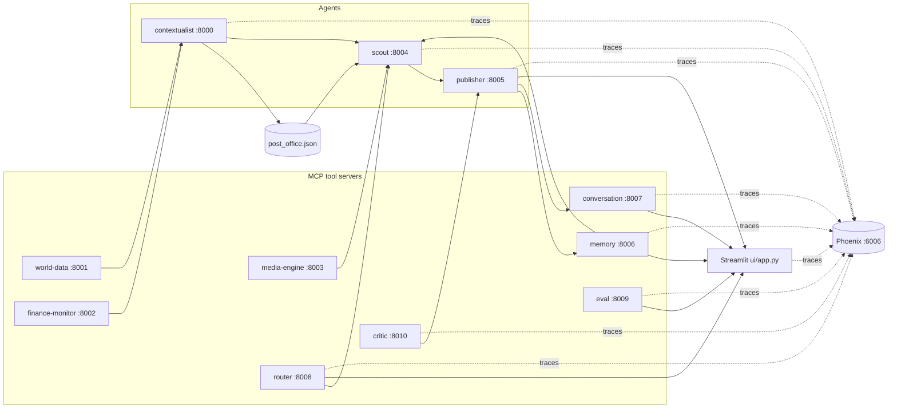

# SYNAPSE — Multi-agent context-aware reports (A2A + MCP)

This project wires several **FastMCP** servers together: lightweight "tool" servers (news, weather, FX, images, persistent memory, conversation state, an LLM-powered router, an evaluation engine, and a **self-critique loop**) feed **agents** that coordinate through a tiny file-based mailbox (**post office** under `synapse/protocol/`). A **Streamlit** UI triggers the Scout and Publisher tools to produce an article grounded in aggregated signals — with dynamic tool selection, intent-aware follow-up routing, end-to-end tracing via Arize Phoenix, LLM-as-judge evaluation, and an **automated draft → critique → revise cycle** that ships only publisher-approved briefs.

## Architecture



- **world-data** — NewsAPI headline search and OpenWeather current conditions.
- **finance-monitor** — Resolves currency from location (REST Countries) and USD conversion rate (ExchangeRate-API).
- **media-engine** — Pexels image search.
- **memory** — Persistent semantic store backed by ChromaDB.
- **conversation** — Stores multi-turn conversation state in a JSON file.
- **router** — LLM-powered routing: decides which tools to invoke per topic and classifies follow-up intent.
- **eval** — LLM-as-judge evaluation engine. Scores briefs on five dimensions and stores run history.
- **critic** — LLM editor that reviews each draft brief and returns an `approve` or `revise` decision with a list of specific, actionable issues.
- **contextualist** — Calls world-data and finance-monitor based on routing flags; writes signal to the post office.
- **scout** — Orchestrates contextualist, media-engine, and memory; passes routing-selected signals to the Publisher.
- **publisher** — Runs the draft → critique → revise loop, then persists the approved brief and seeds the conversation.

Root-level `server.py` and `agent.py` are commented FastMCP examples only; they are not part of the running stack.

## What's new in this branch

### Critic MCP server (`mcp-servers/critic/`)

A new FastMCP server at port **8010** acts as an automated editor. It exposes one tool:

**`review_brief(topic, article, source_payload)`** — reviews a draft brief against the source data and the required four-section structure (headline, body paragraphs, "Why it matters", "About the place of news"). Returns:

```json
{
  "decision": "approve" | "revise",
  "issues": ["<specific, actionable issue>", ...],
  "reasoning": "<one sentence>"
}
```

Design principles:
- **Conservative** — only requests revisions for concrete, fixable problems: hallucinated facts, missing sections, generic language where the source has specifics, internal contradictions.
- **Ignores style** — word choice, section ordering, length within reason are not grounds for revision.
- **Fail-safe** — if the LLM call fails or returns a contradictory response, the server defaults to `approve` so the pipeline never stalls.
- Fully traced via `synapse.tracing`.

### Draft → critique → revise loop in the Publisher Agent

`publish_brief` now runs a multi-stage pipeline internally:

1. **Initial draft** — LLM generates the brief from source data + memory context (unchanged).
2. **Critique** — draft is sent to the Critic. If `approve`, the draft ships immediately.
3. **Revision** — if `revise`, the Publisher calls the LLM again with a targeted revision prompt that quotes the specific issues and instructs it to fix only those without drifting from the source data.
4. Loop repeats up to `MAX_REVISIONS` times (default **2**). If the budget is exhausted, the last draft ships regardless.

**Critique loop is scoped to initial briefs only.** Follow-up conversational replies skip it by design — they're short, conversational, and should stay fast.

The full critique history (each round's decision, issues, reasoning, and a draft excerpt) is returned in the response payload and visible in the UI.

#### Environment controls

| Variable | Default | Effect |
|----------|---------|--------|
| `SYNAPSE_ENABLE_CRITIC` | `true` | Set to `false` to bypass the critique loop entirely. |
| `SYNAPSE_MAX_REVISIONS` | `2` | Maximum revision rounds before shipping the last draft. |

### Critique observability in the Streamlit UI

After generating a brief, the pipeline status now shows:
- `👀 Critic: approved on first draft.` or `👀 Critic: requested N revision(s); approved on attempt M.`

Below the article, a collapsible **"🧐 View critique history"** panel renders each round as an expander showing the critic's decision, reasoning, issues flagged, and a draft excerpt — so you can see exactly what changed between revisions.

### Finance monitor defensive fix

`mcp-servers/finance-monitor/server.py` — added a guard against the REST Countries API returning a non-list or empty response. Previously this caused an `IndexError`; now it falls back cleanly to USD with an informative error message.

---

## Prerequisites

- **Python 3.10+** (tested on 3.13).
- API keys from [OpenAI](https://platform.openai.com/), [NewsAPI](https://newsapi.org/register), [OpenWeatherMap](https://openweathermap.org/api), [ExchangeRate-API](https://www.exchangerate-api.com/), and [Pexels](https://www.pexels.com/api/).

## Setup

Clone the repo, create a virtual environment, install dependencies, and install the local `synapse` package:

```bash
cd multi-agent-system-a2a-mcp
python3 -m venv .venv
source .venv/bin/activate   # Windows: .venv\Scripts\activate

pip install --upgrade pip
pip install -r requirements.txt
pip install -e .
```

Configure secrets (never commit `.env`; it is listed in `.gitignore`):

```bash
cp .env.example .env
# Edit .env and paste your keys.
```

## How to run

### Option A — Single shell (recommended)

```bash
chmod +x scripts/start_backends.sh
./scripts/start_backends.sh
```

Starts Phoenix, all eight MCP servers, and three agents. Then in another terminal:

```bash
source .venv/bin/activate
streamlit run ui/app.py
```

Open **http://localhost:8501** for the app, **http://localhost:6006** for Phoenix traces.

To disable the critique loop for a run:

```bash
SYNAPSE_ENABLE_CRITIC=false streamlit run ui/app.py
```

### Option B — Separate terminals

| Terminal | Command |
|----------|---------|
| 1 | `phoenix serve` |
| 2 | `python mcp-servers/world-data/server.py` |
| 3 | `python mcp-servers/finance-monitor/server.py` |
| 4 | `python mcp-servers/media-engine/server.py` |
| 5 | `python mcp-servers/memory/server.py` |
| 6 | `python mcp-servers/conversation/server.py` |
| 7 | `python mcp-servers/router/server.py` |
| 8 | `python mcp-servers/eval/server.py` |
| 9 | `python mcp-servers/critic/server.py` |
| 10 | `python agents/contextualist_agent/main.py` |
| 11 | `python agents/scout_agent/main.py` |
| 12 | `python agents/publisher_agent/main.py` |
| 13 | `streamlit run ui/app.py` |

### Service ports

| Component | HTTP port |
|-----------|-----------|
| Contextualist | 8000 |
| World data | 8001 |
| Finance monitor | 8002 |
| Media engine | 8003 |
| Scout | 8004 |
| Publisher | 8005 |
| Memory | 8006 |
| Conversation | 8007 |
| Router | 8008 |
| Eval | 8009 |
| Critic | 8010 |
| Phoenix UI + OTLP collector | 6006 |
| Streamlit | 8501 (default) |

## Configuration notes

- **Models:** All LLM calls (Publisher, Router, Critic, Eval judge) use `gpt-5-nano`. Change all call sites to a model you have access to if needed.
- **Critic toggle:** `SYNAPSE_ENABLE_CRITIC=false` disables the critique loop. `SYNAPSE_MAX_REVISIONS=N` controls the revision budget (default 2).
- **Post office:** `synapse/protocol/post_office.json` — scout clears it at the start of each run.
- **Memory store:** ChromaDB under `synapse/memory_store/` (git-ignored).
- **Conversation store:** `synapse/conversations/conversations.json` (git-ignored).
- **Eval results:** `evals/results/runs.json` (git-ignored).
- **Phoenix endpoint:** Override with `PHOENIX_COLLECTOR_ENDPOINT`. Tracing degrades to no-op if unavailable.
- **Critic is optional:** If port 8010 is unreachable, the Publisher falls back to shipping the initial draft without critique.

## Troubleshooting

- **`ModuleNotFoundError: synapse`:** Run `pip install -e .` from the repository root.
- **Critique never triggers / briefs skip revision:** Either the Critic server is down (fallback to approve) or `SYNAPSE_ENABLE_CRITIC=false`. Check the pipeline status panel in the UI.
- **Brief generation is slower than before:** Each critique round adds one LLM call. With `MAX_REVISIONS=2` the worst case is 3 LLM calls (initial + 2 revisions). Set `SYNAPSE_ENABLE_CRITIC=false` to revert to single-call behavior.
- **No spans in Phoenix:** Ensure `phoenix serve` started before the agents.
- **Finance monitor returns USD fallback:** The REST Countries API returned an unexpected response for that city. The fallback is safe; the brief will note the currency as unavailable.
- **Timeouts or empty context:** Confirm all ten MCP processes are listening and `.env` keys are valid.

## Project layout

- `agents/` — Contextualist, Scout, Publisher FastMCP entrypoints.
- `mcp-servers/` — Tool MCP servers: world-data, finance-monitor, media-engine, memory, conversation, router, eval, and **critic**.
- `evals/dataset.json` — 20 curated evaluation topics with rubric hints.
- `evals/run_eval.py` — CLI eval runner.
- `evals/results/` — Persisted run JSON files (git-ignored).
- `synapse/protocol/` — Post office helpers and persisted message file.
- `synapse/tracing.py` — Centralized Phoenix/OpenTelemetry setup.
- `synapse/memory_store/` — ChromaDB vector store (git-ignored).
- `synapse/conversations/` — Conversation thread JSON store (git-ignored).
- `ui/app.py` — Main Streamlit app with critique history panel.
- `ui/pages/1_📊_Evals.py` — Eval results dashboard page.
- `diagnose_memory.py` — Dev utility for testing semantic search.
- `diagnose_conversation.py` — Dev utility for testing the conversation server.
- `diagnose_route.py` — Dev utility for testing routing decisions.
