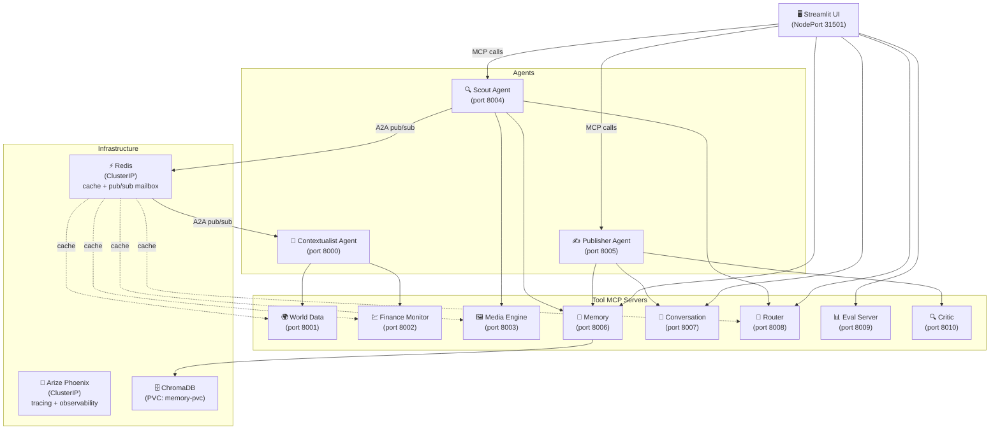

# SYNAPSE — Multi-agent context-aware reports (A2A + MCP)

This project wires several **FastMCP** servers together: lightweight "tool" servers (news, weather, FX, images, persistent memory, conversation state, an LLM-powered router, an evaluation engine, and a self-critique loop) feed **agents** that coordinate through a **Redis pub/sub message broker** (with a JSON-file fallback). A **Streamlit** UI triggers the Scout and Publisher tools to produce an article grounded in aggregated signals — with dynamic tool selection, intent-aware follow-up routing, end-to-end tracing via Arize Phoenix, LLM-as-judge evaluation, a draft → critique → revise cycle, Redis-backed caching, per-run LLM cost tracking, real-time A2A messaging via Redis pub/sub, a full Docker Compose deployment, and now **Kubernetes manifests** — deploy to any cluster with a single script.

## Architecture



## Services

| Service | Port | Role |
|---------|------|------|
| Contextualist Agent | 8000 | Gathers weather, news, FX for a city; reached via Redis pub/sub |
| World Data MCP | 8001 | Weather + news tools |
| Finance Monitor MCP | 8002 | FX rates tool |
| Media Engine MCP | 8003 | Pexels image search |
| Scout Agent | 8004 | Orchestrates full brief pipeline; talks to Contextualist over Redis |
| Publisher Agent | 8005 | Turns Scout output into polished article; runs self-critique loop |
| Memory MCP | 8006 | ChromaDB semantic search — stores/retrieves past briefs |
| Conversation MCP | 8007 | Multi-turn conversation state (JSON store) |
| Router MCP | 8008 | LLM-powered tool selection + intent classification |
| Eval Server MCP | 8009 | LLM-as-judge scoring (5-dimension rubric), run storage |
| Critic MCP | 8010 | Draft review — approve or revise with issues list |
| Redis | 6379 | Caching (TTL per data type) + A2A pub/sub mailbox |
| Arize Phoenix | 6006 | Distributed tracing dashboard |

## What's new in this branch

### Kubernetes manifests (`k8s/`)

Six numbered YAML files that deploy the full stack to any Kubernetes cluster:

| File | Contents |
|------|----------|
| `k8s/00-namespace.yaml` | `synapse` namespace — teardown is `kubectl delete namespace synapse` |
| `k8s/01-configmap.yaml` | `synapse-config` ConfigMap — all `*_HOST` vars pointing to K8s service names (`*-svc`), plus `REDIS_URL`, `PHOENIX_COLLECTOR_ENDPOINT`, and app-level tuning vars |
| `k8s/02-secret-template.yaml` | Template (not committed with values) — create the real secret from `.env` via `kubectl create secret generic` |
| `k8s/03-infra.yaml` | Redis + Phoenix: Deployments + ClusterIP Services + PVCs (1 Gi and 2 Gi) |
| `k8s/04-tool-servers.yaml` | 8 tool MCP servers: Deployments + ClusterIP Services. `memory`, `conversation`, and `eval-server` each mount a PVC for persistent data |
| `k8s/05-agents.yaml` | 3 agents (contextualist, scout, publisher): Deployments + ClusterIP Services |
| `k8s/06-ui.yaml` | Streamlit UI: Deployment + **NodePort** Service on `31501` with a `readinessProbe` on `/_stcore/health` |

Key design decisions:
- **Single image, 13 containers** — same `synapse-app:latest` image (built by the Day 11 Dockerfile), different `command:` per Deployment. Zero new image builds needed.
- **ConfigMap + Secret** — every Deployment uses `envFrom: [configMapRef + secretRef]`. No hardcoded values anywhere in the manifests.
- **Only one external port** — the UI is `NodePort 31501`. All other services are `ClusterIP` (cluster-internal only).
- **PVCs for all stateful data** — memory store (1 Gi), conversations (500 Mi), eval results (500 Mi), Redis data (1 Gi), Phoenix traces (2 Gi). Data survives pod restarts and rolling updates.
- **`synapse/config.py` compatibility** — the ConfigMap keys (`WORLD_DATA_HOST=world-data-svc`, etc.) map exactly to the `*_HOST` env vars that `synapse/config.py` already reads. No code changes required.

### Deploy script (`scripts/k8s_deploy.sh`)

```bash
./scripts/k8s_deploy.sh
```

Steps it runs:
1. `docker build -t synapse-app:latest .`
2. Loads the image into the local cluster (`kind load` or `minikube image load`; override with `SYNAPSE_K8S_CLUSTER=none` for a remote registry)
3. Applies namespace, ConfigMap, Secret (idempotent `--dry-run | apply`), infra, tool servers, agents, UI — in dependency order
4. Waits for infra pods (`tier=infra`) to be Ready before applying the rest
5. Prints pod status and access instructions

### Teardown script (`scripts/k8s_teardown.sh`)

```bash
./scripts/k8s_teardown.sh             # remove deployments, keep PVC data
./scripts/k8s_teardown.sh --volumes   # full wipe including persistent data (prompts for confirmation)
```

## Prerequisites

- Docker + Docker Compose (v2) — for `docker compose up --build`
- OR `kubectl` pointed at a cluster + Docker for Kubernetes deploy
- Supported local clusters: [kind](https://kind.sigs.k8s.io/) or [minikube](https://minikube.sigs.k8s.io/) (Docker Desktop K8s also works)
- API keys: OpenAI, NewsAPI, OpenWeather, ExchangeRate-API, Pexels

## How to run

### Option A — Kubernetes

```bash
cp .env.example .env
# Fill in your API keys in .env

./scripts/k8s_deploy.sh
```

Access points once all pods are `Running`:

| What | How |
|------|-----|
| Streamlit UI | `http://localhost:31501` |
| Phoenix traces | `kubectl port-forward -n synapse svc/phoenix-svc 6006:6006` |
| Redis (for `watch_mailbox.py`) | `kubectl port-forward -n synapse svc/redis-svc 6379:6379` |

Watch pods come up live:
```bash
kubectl get pods -n synapse -w
```

Tear down:
```bash
./scripts/k8s_teardown.sh            # keeps data
./scripts/k8s_teardown.sh --volumes  # full reset
```

### Option B — Docker Compose

```bash
cp .env.example .env
docker compose up --build
```

Open `http://localhost:8501`.

### Option C — Local Python (manual)

```bash
python -m venv .venv && source .venv/bin/activate
pip install -r requirements.txt && pip install -e .
# Start Redis, Phoenix, then each service in its own terminal
# See scripts/start_backends.sh for the full sequence
```

## Configuration

| Variable | Default | Purpose |
|----------|---------|---------|
| `OPENAI_API_KEY` | — | Required |
| `NEWS_API_KEY` | — | NewsAPI |
| `OPENWEATHER_API_KEY` | — | OpenWeather |
| `EXCHANGE_RATE_API_KEY` | — | FX rates |
| `PEXELS_API_KEY` | — | Image search |
| `REDIS_URL` | `redis://localhost:6379` | Cache + pub/sub (overridden in Compose/K8s) |
| `PHOENIX_COLLECTOR_ENDPOINT` | `http://localhost:6006` | Tracing (overridden in Compose/K8s) |
| `SYNAPSE_ENABLE_CRITIC` | `true` | Enable/disable self-critique loop |
| `SYNAPSE_MAX_REVISIONS` | `2` | Max critique iterations |
| `SYNAPSE_USD_TO_INR` | `84.0` | Cost display currency conversion |
| `*_HOST` vars | `0.0.0.0` | Service host — set by Compose/K8s ConfigMap; leave unset for local dev |
| `SYNAPSE_K8S_CLUSTER` | `kind` | Cluster type for deploy script: `kind`, `minikube`, or `none` |
| `KIND_CLUSTER_NAME` | `synapse` | kind cluster name used by deploy script |

## Troubleshooting

| Symptom | Fix |
|---------|-----|
| `ImagePullBackOff` | Image not loaded into cluster — re-run `./scripts/k8s_deploy.sh` |
| Pods stuck in `Pending` | Check PVC provisioning: `kubectl describe pvc -n synapse` |
| UI unreachable on 31501 | Try `kubectl port-forward -n synapse svc/ui-svc 8501:8501` instead |
| Agent pods CrashLoopBackOff | Tool server not ready yet — `kubectl rollout restart deployment/scout-deployment -n synapse` |
| Phoenix not receiving traces | Port-forward: `kubectl port-forward -n synapse svc/phoenix-svc 6006:6006` |
| Secret not found | Re-run deploy script or `kubectl create secret generic synapse-secrets --namespace=synapse --from-env-file=.env` |
| Docker Compose: UI starts before Scout | Run `docker compose up --build` again — services retry on startup |

## Project layout

```
.
├── dockerfile                    # Single image for all Python services
├── docker-compose.yml            # Full stack — Docker Compose (Option B)
├── .dockerignore
├── .env.example                  # Copy to .env — all vars documented
├── k8s/                          # Kubernetes manifests
│   ├── 00-namespace.yaml         # synapse namespace
│   ├── 01-configmap.yaml         # Service hosts + tuning vars
│   ├── 02-secret-template.yaml   # Secret template (do not commit filled values)
│   ├── 03-infra.yaml             # Redis + Phoenix (Deployments, Services, PVCs)
│   ├── 04-tool-servers.yaml      # 8 tool MCP servers
│   ├── 05-agents.yaml            # 3 agents
│   └── 06-ui.yaml                # Streamlit UI (NodePort 31501)
├── scripts/
│   ├── k8s_deploy.sh             # Build image → load into cluster → apply manifests
│   ├── k8s_teardown.sh           # Remove namespace (--volumes for full wipe)
│   ├── start_backends.sh         # Local dev helper
│   └── watch_mailbox.py          # Redis pub/sub mailbox live-tail
├── synapse/
│   ├── config.py                 # Centralized URL resolver (env-var + port)
│   ├── tracing.py                # OpenTelemetry / Phoenix setup
│   ├── cache.py                  # Redis cache with TTL-per-namespace
│   ├── costs.py                  # Token usage extraction + INR formatting
│   └── protocol/
│       └── post_office.py        # Redis pub/sub mailbox (JSON fallback)
├── agents/
│   ├── contextualist_agent/main.py
│   ├── scout_agent/main.py
│   └── publisher_agent/main.py
├── mcp-servers/
│   ├── world-data/server.py      # port 8001
│   ├── finance-monitor/server.py # port 8002
│   ├── media-engine/server.py    # port 8003
│   ├── memory/server.py          # port 8006 — ChromaDB
│   ├── conversation/server.py    # port 8007
│   ├── router/server.py          # port 8008 — LLM routing
│   ├── eval/server.py            # port 8009 — LLM-as-judge
│   └── critic/server.py          # port 8010 — self-critique
├── ui/
│   ├── app.py                    # Streamlit main app (port 8501)
│   └── pages/
│       └── 1_📊_Evals.py
├── evals/
│   ├── dataset.json              # 20 curated eval topics
│   └── run_eval.py               # CLI eval runner
```
