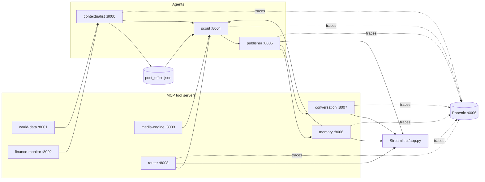

# SYNAPSE — Multi-agent context-aware reports (A2A + MCP)

This project wires several **FastMCP** servers together: lightweight "tool" servers (news, weather, FX, images, persistent memory, conversation state, and an LLM-powered router) feed **agents** that coordinate through a tiny file-based mailbox (**post office** under `synapse/protocol/`). A **Streamlit** UI triggers the Scout and Publisher tools to produce an article grounded in aggregated signals — with dynamic tool selection per topic, intent-aware follow-up routing, and end-to-end distributed tracing via **Arize Phoenix**.

## Architecture



- **world-data** — NewsAPI headline search and OpenWeather current conditions.
- **finance-monitor** — Resolves currency from location (REST Countries) and USD conversion rate (ExchangeRate-API).
- **media-engine** — Pexels image search.
- **memory** — Persistent semantic store backed by ChromaDB. Stores finished briefs and exposes cosine-similarity search.
- **conversation** — Stores multi-turn conversation state in a JSON file.
- **router** — LLM-powered routing server. Decides which tool servers are relevant for a topic and classifies follow-up messages as continued conversation or a pivot.
- **contextualist** — Calls world-data and finance-monitor based on routing flags, merges a structured signal, writes to the post office.
- **scout** — Asks the router which tools to invoke, drives contextualist and media-engine conditionally, queries memory, merges all signals for the Publisher.
- **publisher** — Generates the initial brief (augmented by memory context), seeds a conversation record, and handles follow-up questions.

Root-level `server.py` and `agent.py` are commented FastMCP examples only; they are not part of the running stack.

## What's new in this branch

### End-to-end observability with Arize Phoenix

Every agent, MCP server, and the Streamlit UI now emits OpenTelemetry traces to a local **Phoenix** instance (port **6006**). You can see the full lifecycle of a request — UI click → router decision → contextualist fan-out → memory lookup → publisher LLM call → conversation seeding — as a single distributed trace.

#### `synapse/tracing.py` — centralized setup

A new module provides a two-line instrumentation pattern that every service uses:

```python
from synapse.tracing import setup_tracing, tracer
setup_tracing("publisher-agent")
```

Key properties:

- **Auto-instruments OpenAI** via OpenInference — every `client.responses.create` / `client.chat.completions.create` call appears as a span with model name, prompt, response, token counts, and latency, with **zero manual code**.
- **`tracer` proxy** — a module-level lazy proxy so `from synapse.tracing import tracer` works even before `setup_tracing()` is called.
- **Fail-safe `_NoOpTracer`** — if `arize-phoenix-otel` isn't installed or Phoenix isn't running, every span call becomes a no-op. The system continues to function without traces.
- **Idempotent** — `setup_tracing()` only initializes once per process.
- **Configurable collector** — defaults to `http://localhost:6006`, override with `PHOENIX_COLLECTOR_ENDPOINT`.

#### Instrumented surfaces

Every service in the stack now creates manual spans around its top-level operations and attaches semantic attributes (`topic`, `city`, `memory_hits`, `conversation_id`, routing flags, etc.):

| Service | Notable spans |
|---------|---------------|
| **ui** | `ui.run_scout`, `ui.run_publisher_initial`, `ui.run_publisher_followup`, `ui.route_intent` |
| **contextualist** | `contextualist.contextualize` with `tools_used`/`tools_skipped` attributes |
| **scout** | `scout.scout` covering routing, contextualist call, media fetch, and memory query |
| **publisher** | `publisher.publish_brief`, `publisher.follow_up` |
| **memory** | spans per tool (`store_brief`, `search_briefs`, etc.) |
| **conversation** | spans per tool (`start_conversation`, `add_turn`, etc.) |
| **router** | `router.route_tools`, `router.route_intent` |

OpenAI calls inside any of these spans are auto-captured as child spans by OpenInference — no extra code required.

#### Phoenix UI link in Streamlit

The UI exposes the Phoenix endpoint (`PHOENIX_UI_URL`) so traces are one click away while debugging the live app.

#### Startup ordering

`scripts/start_backends.sh` now launches **Phoenix first** (`phoenix serve`) and sleeps briefly so the OTLP collector is bound before any agent tries to export spans.

### New dependencies

```text
arize-phoenix>=4.0
arize-phoenix-otel>=0.5
openinference-instrumentation-openai>=0.1.18
opentelemetry-api>=1.20
opentelemetry-sdk>=1.20
```

These have been added to both `requirements.txt` and `pyproject.toml`. Package version is bumped to **0.3.0**.

---

## Prerequisites

- **Python 3.10+** (tested on 3.13).
- API keys from [OpenAI](https://platform.openai.com/), [NewsAPI](https://newsapi.org/register), [OpenWeatherMap](https://openweathermap.org/api), [ExchangeRate-API](https://www.exchangerate-api.com/), and [Pexels](https://www.pexels.com/api/).

## Setup

Clone the repo, create a virtual environment, install dependencies (now including Phoenix), and install the small local `synapse` package so `from synapse.protocol...` and `from synapse.tracing...` resolve from any working directory:

```bash
cd multi-agent-system-a2a-mcp
python3 -m venv .venv
source .venv/bin/activate   # Windows: .venv\Scripts\activate

pip install --upgrade pip
pip install -r requirements.txt
pip install -e .
```

Configure secrets (never commit `.env`; it is listed in `.gitignore`):

```bash
cp .env.example .env
# Edit .env and paste your keys.
```

## How to run

You need **Phoenix**, **one process per MCP/agent server**, plus **Streamlit**. All HTTP MCP endpoints use host `0.0.0.0` so they listen on every interface; tools are exposed under each server's `/mcp` URL.

### Option A — Single shell (background workers, recommended)

From the repo root with the virtual environment activated:

```bash
chmod +x scripts/start_backends.sh
./scripts/start_backends.sh
```

That script now starts **Phoenix first** (port 6006) and then all six MCP tool servers and three agents. Leave it running.

In **another** terminal:

```bash
source .venv/bin/activate
streamlit run ui/app.py
```

Open the Streamlit URL (usually http://localhost:8501) for the app, and **http://localhost:6006** for the Phoenix trace explorer.

### Option B — Separate terminals

With `source .venv/bin/activate` and repo root as the current directory:

| Terminal | Command |
|----------|---------|
| 1 | `phoenix serve` |
| 2 | `python mcp-servers/world-data/server.py` |
| 3 | `python mcp-servers/finance-monitor/server.py` |
| 4 | `python mcp-servers/media-engine/server.py` |
| 5 | `python mcp-servers/memory/server.py` |
| 6 | `python mcp-servers/conversation/server.py` |
| 7 | `python mcp-servers/router/server.py` |
| 8 | `python agents/contextualist_agent/main.py` |
| 9 | `python agents/scout_agent/main.py` |
| 10 | `python agents/publisher_agent/main.py` |
| 11 | `streamlit run ui/app.py` |

### Service ports

| Component | HTTP port |
|-----------|-----------|
| Contextualist | 8000 |
| World data | 8001 |
| Finance monitor | 8002 |
| Media engine | 8003 |
| Scout | 8004 |
| Publisher | 8005 |
| Memory | 8006 |
| Conversation | 8007 |
| Router | 8008 |
| **Phoenix UI + OTLP collector** | **6006** |
| Streamlit | 8501 (default) |

## Configuration notes

- **Models:** Publisher uses `gpt-5-nano` via `client.responses.create`; the Router and UI use the same model for routing decisions and location extraction. Change all call sites if your account doesn't expose that model.
- **Post office:** `synapse/protocol/post_office.json` stores in-flight coordination messages between contextualist and scout. The scout clears it at the start of each run.
- **Memory store:** ChromaDB persists vectors under `synapse/memory_store/` (git-ignored).
- **Conversation store:** Threads persist in `synapse/conversations/conversations.json` (git-ignored).
- **Pivot confidence threshold:** Adjust `PIVOT_CONFIDENCE_THRESHOLD` in `ui/app.py` (default `0.70`) to make pivot detection more/less aggressive.
- **Phoenix endpoint:** Set `PHOENIX_COLLECTOR_ENDPOINT` to point services at a remote Phoenix instance (default `http://localhost:6006`). When unset/unavailable, tracing degrades to a no-op — the app continues to work.
- **Disabling tracing:** Simply don't install the Phoenix packages, or don't run `phoenix serve`. `synapse.tracing` will fall back to `_NoOpTracer` and the rest of the stack is unaffected.

## Troubleshooting

- **`ModuleNotFoundError: synapse`:** Run `pip install -e .` from the repository root inside your active virtual environment.
- **`[tracing] arize-phoenix-otel not installed`:** Re-run `pip install -r requirements.txt` — the Phoenix packages were added in this release.
- **No spans appear in Phoenix:** Confirm `phoenix serve` is running on port 6006 before launching the agents. Restart the services after Phoenix is up so they re-register their exporters.
- **OpenAI calls aren't traced:** Make sure `setup_tracing()` is called **before** `from openai import OpenAI` is imported in that module — OpenInference patches at import time.
- **Timeouts or empty context:** Confirm all nine MCP processes are listening and `.env` keys are valid for upstream APIs.
- **Router line missing in UI:** Router server (port 8008) is not running.
- **ChromaDB download on first run:** ONNX MiniLM embedding model (~80 MB) is downloaded from Hugging Face on first memory server start.

## Project layout

- `agents/` — Contextualist, Scout, Publisher FastMCP entrypoints (all traced).
- `mcp-servers/` — Tool MCP servers: world-data, finance-monitor, media-engine, memory, conversation, router (all traced).
- `synapse/protocol/` — Post office helpers and persisted message file.
- `synapse/tracing.py` — **NEW:** centralized Phoenix/OpenTelemetry setup with fail-safe no-op fallback.
- `synapse/memory_store/` — ChromaDB vector store (git-ignored).
- `synapse/conversations/` — JSON store for conversation threads (git-ignored).
- `ui/app.py` — Streamlit frontend with router observability, pivot detection, conversation sidebar, past-brief panel, and trace spans.
- `diagnose_memory.py` — Dev utility for testing semantic search against the memory server.
- `diagnose_conversation.py` — Dev utility for testing the conversation server end-to-end.
- `diagnose_route.py` — Dev utility for testing tool routing and intent classification.
