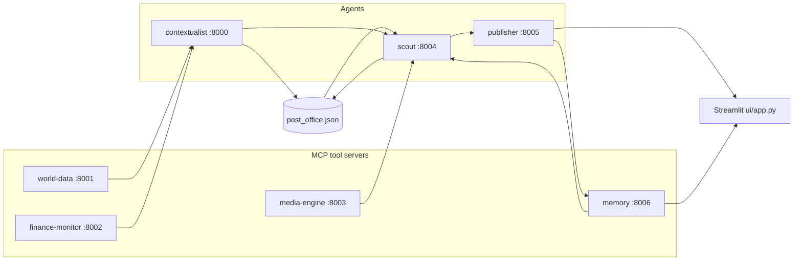

# SYNAPSE — Multi-agent context-aware reports (A2A + MCP)

This project wires several **FastMCP** servers together: lightweight “tool” servers (news, weather, FX, images, and **persistent memory**) feed **agents** that coordinate through a tiny file-based mailbox (**post office** under `synapse/protocol/`). A **Streamlit** UI triggers the Scout and Publisher tools to produce an article grounded in aggregated signals — and now recalls and builds on previously published briefs via semantic memory.

## Architecture



- **world-data** — NewsAPI headline search and OpenWeather current conditions.
- **finance-monitor** — Resolves currency from location (REST Countries) and USD conversion rate (ExchangeRate-API).
- **media-engine** — Pexels image search.
- **memory** — Persistent semantic store backed by ChromaDB. Stores finished briefs and exposes semantic search so agents can recall related prior coverage.
- **contextualist** — Calls world-data and finance-monitor, merges a structured signal, writes to the post office for the scout.
- **scout** — Drives contextualist and media-engine, queries the memory server for related past briefs, merges all signals for the Publisher.
- **publisher** — OpenAI Responses API generates the final brief, augmented by past-brief context from memory, then persists the new brief back to memory.

Root-level `server.py` and `agent.py` are commented FastMCP examples only; they are not part of the running stack.

## What's new in this branch

### Persistent semantic memory (`mcp-servers/memory/`)

A new FastMCP server at port **8006** backs every brief with a ChromaDB vector store under `synapse/memory_store/`. It exposes five tools:

| Tool | Description |
|------|-------------|
| `store_brief` | Persist a finished brief (topic + article + payload) to long-term memory. |
| `search_briefs` | Cosine-similarity search across all stored briefs; filters by a distance threshold so unrelated topics return nothing. |
| `list_recent_briefs` | Return the N most recent briefs sorted by creation time. |
| `get_brief` | Retrieve the full content of a single brief by ID. |
| `delete_brief` | Remove a brief (useful during development). |

ChromaDB's default ONNX MiniLM embedding function is used — downloaded automatically (~80 MB) on first run. Briefs are stored on disk at `synapse/memory_store/`.

### Memory-aware Scout Agent

The Scout now connects to the memory server (best-effort — if the server is down the run continues without memory). Before assembling the final signal it calls `search_briefs` with the current topic and attaches the top-3 results as a `memory_context` field in the payload passed to the Publisher.

### Memory-aware Publisher Agent

The Publisher reads `memory_context` from the Scout payload and inserts a structured "past briefs" section into the LLM prompt so the model can build on prior coverage instead of repeating it. After generating the article it calls `store_brief` to persist the new brief.

### Memory sidebar in the Streamlit UI

- A **Past Briefs** sidebar lists recent briefs from memory with clickable buttons to view full articles.
- The main pipeline status shows how many related past briefs were found and used.
- An in-page **Past Brief Viewer** renders the full article, topic, city, and creation date for any selected brief.

### Diagnostics script

`diagnose_memory.py` (repo root) — run it with the memory server running to interactively test semantic search against a set of sample queries.

---

## Prerequisites

- **Python 3.10+** (tested on 3.13).
- API keys from [OpenAI](https://platform.openai.com/), [NewsAPI](https://newsapi.org/register), [OpenWeatherMap](https://openweathermap.org/api), [ExchangeRate-API](https://www.exchangerate-api.com/), and [Pexels](https://www.pexels.com/api/).

## Setup

Clone the repo, create a virtual environment, install dependencies, and install the small local `synapse` package so `from synapse.protocol...` resolves from any working directory:

```bash
cd multi-agent-system-a2a-mcp
python3 -m venv .venv
source .venv/bin/activate   # Windows: .venv\Scripts\activate

pip install --upgrade pip
pip install -r requirements.txt
pip install -e .
```

Configure secrets (never commit `.env`; it is listed in `.gitignore`):

```bash
cp .env.example .env
# Edit .env and paste your keys.
```

## How to run

You need **one process per MCP/agent server** plus **Streamlit**. All HTTP MCP endpoints use host `0.0.0.0` so they listen on every interface; tools are exposed under each server’s `/mcp` URL.

### Option A — Single shell (background workers)

From the repo root with the virtual environment activated:

```bash
chmod +x scripts/start_backends.sh
./scripts/start_backends.sh
```

That script starts world-data, finance, media-engine, contextualist, scout, and publisher together. Leave it running.

In **another** terminal:

```bash
source .venv/bin/activate
streamlit run ui/app.py
```

Open the URL Streamlit prints (usually http://localhost:8501). Enter a topic and click **Generate Report**.

### Option B — Separate terminals

With `source .venv/bin/activate` and repo root as the current directory:

| Terminal | Command |
|----------|---------|
| 1 | `python mcp-servers/world-data/server.py` |
| 2 | `python mcp-servers/finance-monitor/server.py` |
| 3 | `python mcp-servers/media-engine/server.py` |
| 4 | `python mcp-servers/memory/server.py` |
| 5 | `python agents/contextualist_agent/main.py` |
| 6 | `python agents/scout_agent/main.py` |
| 7 | `python agents/publisher_agent/main.py` |
| 8 | `streamlit run ui/app.py` |

### Service ports

| Component | HTTP port |
|-----------|-----------|
| Contextualist | 8000 |
| World data | 8001 |
| Finance monitor | 8002 |
| Media engine | 8003 |
| Scout | 8004 |
| Publisher | 8005 |
| Memory | 8006 |
| Streamlit | 8501 (default) |

## Configuration notes

- **Models:** The Publisher uses `gpt-5-nano` via `client.responses.create`, and the UI uses the same model name for location extraction (`ui/app.py`). If your OpenAI account does not expose that model, change both call sites to a model you have access to (for example `gpt-4o-mini`).
- **Post office:** `synapse/protocol/post_office.json` stores in-flight coordination messages between contextualist and scout. The scout clears it at the start of each run.
- **Memory store:** ChromaDB persists vectors under `synapse/memory_store/` (created automatically on first run, listed in `.gitignore`). The memory MCP server uses cosine distance with a threshold of `0.7` — adjust `MEMORY_DISTANCE_THRESHOLD` in `mcp-servers/memory/server.py` if you want more or fewer results surfaced.
- **Memory server is optional:** If the memory server is not running, Scout and Publisher fall back gracefully — briefs are generated without past-context and are not persisted.

## Troubleshooting

- **`ModuleNotFoundError: synapse`:** Run `pip install -e .` from the repository root inside your active virtual environment.
- **Timeouts or empty context:** Confirm all seven MCP processes are listening and `.env` keys are valid for the upstream APIs.
- **Memory sidebar shows "Memory server unavailable":** The memory server (port 8006) is not running. Start it with `python mcp-servers/memory/server.py` or include it via `start_backends.sh`. Briefs generated while the server is down will not be stored.
- **ChromaDB download on first run:** The default embedding model (~80 MB ONNX MiniLM) is downloaded from Hugging Face when the memory server starts for the first time. Ensure internet access and enough disk space.
- **Semantic search returns no results:** Either memory is empty (generate a brief first) or the distance threshold is filtering all results. Run `python diagnose_memory.py` with the memory server running to inspect distances.

## Project layout

- `agents/` — Contextualist, Scout, Publisher FastMCP entrypoints.
- `mcp-servers/` — Tool MCP servers: world-data, finance-monitor, media-engine, and the new **memory** server.
- `synapse/protocol/` — Post office helpers and persisted message file.
- `synapse/memory_store/` — ChromaDB vector store created on first run (git-ignored).
- `ui/app.py` — Streamlit frontend with memory sidebar and past-brief viewer.
- `diagnose_memory.py` — Development utility for testing semantic search against the running memory server.
