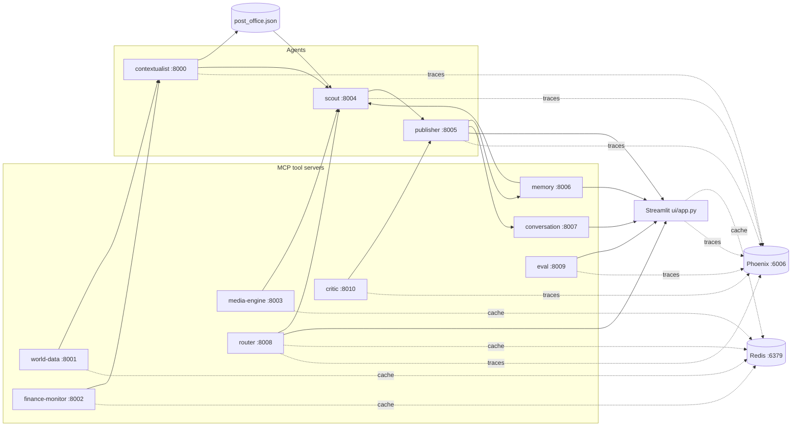

# SYNAPSE — Multi-agent context-aware reports (A2A + MCP)

This project wires several **FastMCP** servers together: lightweight "tool" servers (news, weather, FX, images, persistent memory, conversation state, an LLM-powered router, an evaluation engine, and a self-critique loop) feed **agents** that coordinate through a tiny file-based mailbox (**post office** under `synapse/protocol/`). A **Streamlit** UI triggers the Scout and Publisher tools to produce an article grounded in aggregated signals — with dynamic tool selection, intent-aware follow-up routing, end-to-end tracing via Arize Phoenix, LLM-as-judge evaluation, a draft → critique → revise cycle, and now **Redis-backed caching** and **per-run LLM cost tracking**.

## Architecture



- **world-data** — NewsAPI headline search and OpenWeather current conditions. Results cached in Redis.
- **finance-monitor** — Currency resolution and USD conversion rate. Results cached in Redis.
- **media-engine** — Pexels image search. Results cached in Redis.
- **memory** — Persistent semantic store backed by ChromaDB.
- **conversation** — Stores multi-turn conversation state in a JSON file.
- **router** — LLM-powered routing: tool selection per topic (cached) and follow-up intent classification.
- **eval** — LLM-as-judge evaluation engine.
- **critic** — LLM editor for the draft → critique → revise loop.
- **contextualist** — Calls world-data and finance-monitor based on routing flags.
- **scout** — Orchestrates contextualist, media-engine, and memory.
- **publisher** — Runs the draft → critique → revise loop; tracks and returns consolidated LLM cost.

Root-level `server.py` and `agent.py` are commented FastMCP examples only.

## What's new in this branch

### Redis-backed caching (`synapse/cache.py`)

A new `synapse/cache.py` module provides a simple, drop-in cache layer over Redis:

```python
from synapse.cache import get_cached, set_cached, TTL

cached = get_cached("news", {"query": query})
if cached:
    cached["_cache_hit"] = True
    return cached

result = expensive_external_call()
set_cached("news", {"query": query}, result, ttl_seconds=TTL["news"])
result["_cache_hit"] = False
return result
```

**Key properties:**
- **Fail-safe** — if the `redis` package isn't installed or Redis is unreachable, `get_cached` returns `None` and `set_cached` returns `False`. The system runs without caching and nothing breaks.
- **Deterministic keys** — cache key = `synapse:<namespace>:md5(sorted_json(params))[:16]`. Same inputs always hit the same key.
- **Configurable endpoint** — `REDIS_URL` env var (default `redis://localhost:6379`).
- **`_cache_hit` flag** — every cached response carries `_cache_hit: true/false` so the UI can surface it.
- **`stats()`** helper returns Redis keyspace hits/misses, total keys, and memory usage.

#### Default TTLs by data type

| Namespace | TTL | Rationale |
|-----------|-----|-----------|
| `news` | 5 min | News churns fast |
| `weather` | 10 min | Stable enough for a brief |
| `fx` | 10 min | FX moves slowly |
| `media` | 1 hour | Stock images don't change |
| `router_tools` | 1 hour | Same topic → same routing decision |
| `city` | 1 hour | Same topic → same capital |

#### Instrumented services

| Service | What's cached |
|---------|---------------|
| **world-data** | `search_news` by query, `get_weather` by city + units |
| **finance-monitor** | `get_currency_code` and `get_fx_rate` by city |
| **media-engine** | `search_images` by query + page size |
| **router** | `route_tools` decisions by topic (`route_intent` is not cached — turns change) |
| **ui** | `get_location_context` (city detection) by topic |

### Token & cost tracking (`synapse/costs.py`)

A new `synapse/costs.py` module normalizes token usage from both the Responses API (`input_tokens`/`output_tokens`) and Chat Completions API (`prompt_tokens`/`completion_tokens`) into a single shape and computes USD cost estimates:

```python
from synapse.costs import extract_usage, accumulate, format_cost_inr

text, response = openai_call(prompt)
usage = extract_usage(response, model="gpt-5-nano")
# → {model, input_tokens, output_tokens, total_tokens, cost_usd}

accumulate(total_usage, usage)
print(format_cost_inr(total_usage["cost_usd"]))  # → "₹0.023"
```

#### Cost collection per brief

The Publisher now accumulates usage from every LLM call it makes (initial draft, each revision, each critic call, and the router's decision that arrived via the payload) into a single `usage` object returned in the response:

```json
{
  "usage": {
    "input_tokens": 4200, "output_tokens": 820,
    "total_tokens": 5020, "cost_usd": 0.000549,
    "calls": 3,
    "by_source": {
      "publisher": {...},
      "critic": {...},
      "router": {...}
    }
  }
}
```

Follow-up replies also return their own single-call `usage`.

#### Cost & cache panel in the Streamlit UI

After generating a brief, a **💰 Cost & Cache** section appears below the article with four metrics:

| Metric | Detail |
|--------|--------|
| **Total cost** | In INR (hover for USD) |
| **LLM calls** | Number of LLM round-trips for this brief |
| **Total tokens** | Input + output across all calls |
| **Cache hits** | `N/M` tool servers that returned cached data |

An expandable detail panel shows a per-source breakdown (publisher, critic, router) and which tool servers hit/missed the cache.

#### INR conversion rate

Configurable via `SYNAPSE_USD_TO_INR` env var (default `84.0`).

### Redis startup check in `start_backends.sh`

The startup script now checks whether Redis is reachable before launching services, and prints actionable instructions if it isn't (`brew services start redis` / `docker run -d -p 6379:6379 redis`). Cache unavailability is non-fatal — the system runs without it.

### New dependency

```text
redis>=5.0
```

Added to `requirements.txt` and `pyproject.toml`.

---

## Prerequisites

- **Python 3.10+** (tested on 3.13).
- **Redis** (optional but recommended for caching). Install via `brew install redis`, `apt install redis-server`, or `docker run -d -p 6379:6379 redis`.
- API keys from [OpenAI](https://platform.openai.com/), [NewsAPI](https://newsapi.org/register), [OpenWeatherMap](https://openweathermap.org/api), [ExchangeRate-API](https://www.exchangerate-api.com/), and [Pexels](https://www.pexels.com/api/).

## Setup

```bash
cd multi-agent-system-a2a-mcp
python3 -m venv .venv
source .venv/bin/activate   # Windows: .venv\Scripts\activate

pip install --upgrade pip
pip install -r requirements.txt
pip install -e .
```

Configure secrets:

```bash
cp .env.example .env
# Edit .env and paste your keys.
# Optional: REDIS_URL, SYNAPSE_USD_TO_INR
```

## How to run

### Option A — Single shell (recommended)

```bash
# Start Redis first (if not already running)
brew services start redis   # macOS
# or: docker run -d -p 6379:6379 redis

chmod +x scripts/start_backends.sh
./scripts/start_backends.sh
```

Then in another terminal:

```bash
source .venv/bin/activate
streamlit run ui/app.py
```

Open **http://localhost:8501** for the app, **http://localhost:6006** for Phoenix traces.

### Option B — Separate terminals

| Terminal | Command |
|----------|---------|
| 1 | `redis-server` (or start as a service) |
| 2 | `phoenix serve` |
| 3 | `python mcp-servers/world-data/server.py` |
| 4 | `python mcp-servers/finance-monitor/server.py` |
| 5 | `python mcp-servers/media-engine/server.py` |
| 6 | `python mcp-servers/memory/server.py` |
| 7 | `python mcp-servers/conversation/server.py` |
| 8 | `python mcp-servers/router/server.py` |
| 9 | `python mcp-servers/eval/server.py` |
| 10 | `python mcp-servers/critic/server.py` |
| 11 | `python agents/contextualist_agent/main.py` |
| 12 | `python agents/scout_agent/main.py` |
| 13 | `python agents/publisher_agent/main.py` |
| 14 | `streamlit run ui/app.py` |

### Service ports

| Component | HTTP port |
|-----------|-----------|
| Contextualist | 8000 |
| World data | 8001 |
| Finance monitor | 8002 |
| Media engine | 8003 |
| Scout | 8004 |
| Publisher | 8005 |
| Memory | 8006 |
| Conversation | 8007 |
| Router | 8008 |
| Eval | 8009 |
| Critic | 8010 |
| Redis | 6379 |
| Phoenix UI + OTLP collector | 6006 |
| Streamlit | 8501 (default) |

## Configuration notes

- **Redis URL:** `REDIS_URL` (default `redis://localhost:6379`). If unset or unreachable, all caching is silently disabled.
- **INR rate:** `SYNAPSE_USD_TO_INR` (default `84.0`) for UI cost display.
- **Critic toggle:** `SYNAPSE_ENABLE_CRITIC=false` disables the critique loop; `SYNAPSE_MAX_REVISIONS=N` sets the revision budget (default 2).
- **Models:** All LLM calls use `gpt-5-nano`. Change all call sites if needed.
- **Phoenix endpoint:** `PHOENIX_COLLECTOR_ENDPOINT` (default `http://localhost:6006`).
- **Cache TTLs:** Edit `synapse/cache.py` `TTL` dict to adjust freshness per data type.

## Troubleshooting

- **`ModuleNotFoundError: synapse`:** Run `pip install -e .` from the repo root.
- **`[cache] Redis unreachable`:** Start Redis or set `REDIS_URL`. Cache disables gracefully; everything still works.
- **Cost panel shows ₹0.00:** Either the LLM calls returned no usage metadata, or the brief was served entirely from cache.
- **Cache hits always 0:** Redis isn't running, or this is the first run for these inputs. Run the same topic a second time to verify caching works.
- **No spans in Phoenix:** Ensure `phoenix serve` started before the agents.
- **Timeouts or empty context:** Confirm all services are running and `.env` keys are valid.

## Project layout

- `agents/` — Contextualist, Scout, Publisher FastMCP entrypoints.
- `mcp-servers/` — world-data, finance-monitor, media-engine, memory, conversation, router, eval, critic.
- `evals/dataset.json` — 20 curated evaluation topics.
- `evals/run_eval.py` — CLI eval runner.
- `evals/results/` — Persisted run JSON files (git-ignored).
- `synapse/cache.py` — **NEW:** Redis-backed cache with fail-safe no-op fallback.
- `synapse/costs.py` — **NEW:** Token normalization and USD/INR cost estimation.
- `synapse/tracing.py` — Centralized Phoenix/OpenTelemetry setup.
- `synapse/protocol/` — Post office helpers and persisted message file.
- `synapse/memory_store/` — ChromaDB vector store (git-ignored).
- `synapse/conversations/` — Conversation thread JSON store (git-ignored).
- `ui/app.py` — Main Streamlit app with cost & cache panel.
- `ui/pages/1_📊_Evals.py` — Eval results dashboard.
- `diagnose_memory.py` — Dev utility for semantic search testing.
- `diagnose_conversation.py` — Dev utility for conversation server testing.
- `diagnose_route.py` — Dev utility for routing decisions testing.
