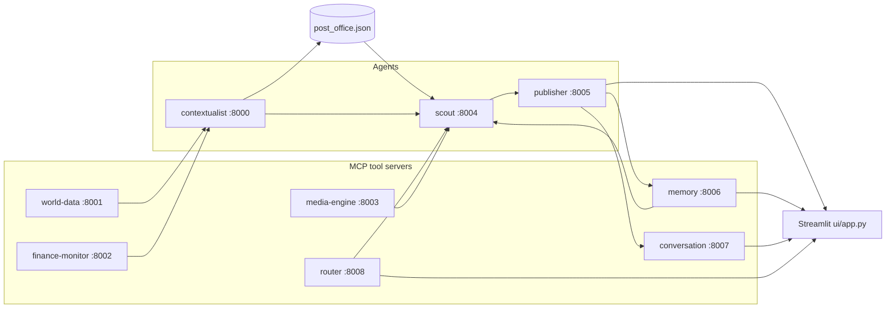

# SYNAPSE — Multi-agent context-aware reports (A2A + MCP)

This project wires several **FastMCP** servers together: lightweight "tool" servers (news, weather, FX, images, persistent memory, conversation state, and an LLM-powered router) feed **agents** that coordinate through a tiny file-based mailbox (**post office** under `synapse/protocol/`). A **Streamlit** UI triggers the Scout and Publisher tools to produce an article grounded in aggregated signals — with dynamic tool selection per topic and intent-aware follow-up routing in conversations.

## Architecture



- **world-data** — NewsAPI headline search and OpenWeather current conditions.
- **finance-monitor** — Resolves currency from location (REST Countries) and USD conversion rate (ExchangeRate-API).
- **media-engine** — Pexels image search.
- **memory** — Persistent semantic store backed by ChromaDB. Stores finished briefs and exposes cosine-similarity search so agents can recall related prior coverage.
- **conversation** — Stores multi-turn conversation state in a JSON file. Tracks every user question and assistant reply tied to a brief.
- **router** — LLM-powered routing server. Decides which tool servers are relevant for a given topic and classifies follow-up messages as continued conversation or a pivot to a new topic.
- **contextualist** — Calls world-data and finance-monitor based on routing flags, merges a structured signal, writes to the post office for the scout.
- **scout** — Asks the router which tools to invoke, drives contextualist and media-engine conditionally, queries memory, and merges all signals for the Publisher.
- **publisher** — Generates the initial brief (augmented by memory context), seeds a conversation record, and handles follow-up questions.

Root-level `server.py` and `agent.py` are commented FastMCP examples only; they are not part of the running stack.

## What's new in this branch

### LLM-powered Router (`mcp-servers/router/`)

A new FastMCP server at port **8008** makes dynamic routing decisions using the OpenAI chat API in JSON mode. It exposes two tools:

| Tool | Description |
|------|-------------|
| `route_tools` | Given a topic, decides which tool servers (news, weather, FX, media) are relevant. Returns boolean flags and a one-sentence rationale. Fails safe — enables all tools if the LLM call fails. |
| `route_intent` | Given a chat message and recent conversation turns, classifies the message as a `follow_up` (elaborates on the current topic) or a `pivot` (new topic needing a fresh brief). Returns intent, confidence score, a suggested topic for pivots, and a rationale. Fails safe — defaults to `follow_up`. |

### Dynamic tool selection in the Scout and Contextualist

Before each pipeline run, the Scout calls `route_tools` and passes the resulting boolean flags (`use_news`, `use_weather`, `use_fx`) to the Contextualist. The Contextualist only opens MCP clients and makes API calls for the enabled tools, skipping the rest. The `tools_used` and `tools_skipped` lists are returned on the signal so the UI can surface them. Media fetching in the Scout is similarly gated on the `use_media` flag. The `routing_decision` dict rides along in the final payload for full observability.

### Intent-aware follow-up in the UI

When the user types a message in conversation mode, the UI first calls `route_intent`. If the router returns `pivot` with confidence ≥ 0.70 (`PIVOT_CONFIDENCE_THRESHOLD`), the UI pauses and shows a confirmation prompt:

- **Start fresh brief** — resets the session and pre-fills the topic input with the router's suggested topic.
- **Continue here anyway** — treats the message as a follow-up regardless.

Below the pivot threshold the message is sent directly to the Publisher's `follow_up` tool as before.

### Routing observability in the UI

- The pipeline status panel now shows a **Router** line (e.g. `✅ news, weather · ⏭️ skipped fx, media`) with the router's rationale beneath it.
- The conversation header caption also displays the routing decision for the initial brief.

### Diagnostics script

`diagnose_route.py` (repo root) — tests both `route_tools` (several topics) and `route_intent` (follow-up and pivot cases) against a live router server.

---

## Prerequisites

- **Python 3.10+** (tested on 3.13).
- API keys from [OpenAI](https://platform.openai.com/), [NewsAPI](https://newsapi.org/register), [OpenWeatherMap](https://openweathermap.org/api), [ExchangeRate-API](https://www.exchangerate-api.com/), and [Pexels](https://www.pexels.com/api/).

## Setup

Clone the repo, create a virtual environment, install dependencies, and install the small local `synapse` package so `from synapse.protocol...` resolves from any working directory:

```bash
cd multi-agent-system-a2a-mcp
python3 -m venv .venv
source .venv/bin/activate   # Windows: .venv\Scripts\activate

pip install --upgrade pip
pip install -r requirements.txt
pip install -e .
```

Configure secrets (never commit `.env`; it is listed in `.gitignore`):

```bash
cp .env.example .env
# Edit .env and paste your keys.
```

## How to run

You need **one process per MCP/agent server** plus **Streamlit**. All HTTP MCP endpoints use host `0.0.0.0` so they listen on every interface; tools are exposed under each server's `/mcp` URL.

### Option A — Single shell (background workers)

From the repo root with the virtual environment activated:

```bash
chmod +x scripts/start_backends.sh
./scripts/start_backends.sh
```

That script starts world-data, finance-monitor, media-engine, memory, conversation, router, contextualist, scout, and publisher together. Leave it running.

In **another** terminal:

```bash
source .venv/bin/activate
streamlit run ui/app.py
```

Open the URL Streamlit prints (usually http://localhost:8501). Enter a topic and click **Generate Brief**.

### Option B — Separate terminals

With `source .venv/bin/activate` and repo root as the current directory:

| Terminal | Command |
|----------|---------|
| 1 | `python mcp-servers/world-data/server.py` |
| 2 | `python mcp-servers/finance-monitor/server.py` |
| 3 | `python mcp-servers/media-engine/server.py` |
| 4 | `python mcp-servers/memory/server.py` |
| 5 | `python mcp-servers/conversation/server.py` |
| 6 | `python mcp-servers/router/server.py` |
| 7 | `python agents/contextualist_agent/main.py` |
| 8 | `python agents/scout_agent/main.py` |
| 9 | `python agents/publisher_agent/main.py` |
| 10 | `streamlit run ui/app.py` |

### Service ports

| Component | HTTP port |
|-----------|-----------|
| Contextualist | 8000 |
| World data | 8001 |
| Finance monitor | 8002 |
| Media engine | 8003 |
| Scout | 8004 |
| Publisher | 8005 |
| Memory | 8006 |
| Conversation | 8007 |
| Router | 8008 |
| Streamlit | 8501 (default) |

## Configuration notes

- **Models:** The Publisher uses `gpt-5-nano` via `client.responses.create`; the Router and UI use the same model for location extraction and routing decisions. If your OpenAI account does not expose that model, update all call sites to a model you have access to (for example `gpt-4o-mini`).
- **Post office:** `synapse/protocol/post_office.json` stores in-flight coordination messages between contextualist and scout. The scout clears it at the start of each run.
- **Memory store:** ChromaDB persists vectors under `synapse/memory_store/` (created on first run, git-ignored).
- **Conversation store:** All threads persist in `synapse/conversations/conversations.json` (created on first run, git-ignored).
- **Pivot confidence threshold:** The UI only prompts the user to start a fresh brief when intent confidence is ≥ 0.70. Adjust `PIVOT_CONFIDENCE_THRESHOLD` in `ui/app.py` to make pivot detection more or less aggressive.
- **Router is optional:** If the router server is not running, the Scout falls back to enabling all tools and the UI skips intent classification, routing all messages directly to `follow_up`.

## Troubleshooting

- **`ModuleNotFoundError: synapse`:** Run `pip install -e .` from the repository root inside your active virtual environment.
- **Timeouts or empty context:** Confirm all nine MCP processes are listening and `.env` keys are valid for the upstream APIs.
- **Router line missing in the UI:** The router server (port 8008) is not running. Start it with `python mcp-servers/router/server.py`. The pipeline continues without it.
- **Pivot prompt never appears:** Either the router is down (silent fallback to follow-up) or the confidence threshold is too high. Run `python diagnose_route.py` to check router output directly.
- **Memory or conversation servers unavailable:** Start them individually (`python mcp-servers/memory/server.py`, `python mcp-servers/conversation/server.py`). Both fail gracefully.
- **ChromaDB download on first run:** The ONNX MiniLM embedding model (~80 MB) is downloaded from Hugging Face on the first memory server start.

## Project layout

- `agents/` — Contextualist, Scout, Publisher FastMCP entrypoints.
- `mcp-servers/` — Tool MCP servers: world-data, finance-monitor, media-engine, memory, conversation, and **router**.
- `synapse/protocol/` — Post office helpers and persisted message file.
- `synapse/memory_store/` — ChromaDB vector store, created on first run (git-ignored).
- `synapse/conversations/` — JSON store for conversation threads, created on first run (git-ignored).
- `ui/app.py` — Streamlit frontend with router observability, pivot detection, conversation sidebar, and past-brief panel.
- `diagnose_memory.py` — Dev utility for testing semantic search against the memory server.
- `diagnose_conversation.py` — Dev utility for testing the conversation server end-to-end.
- `diagnose_route.py` — Dev utility for testing tool routing and intent classification.
