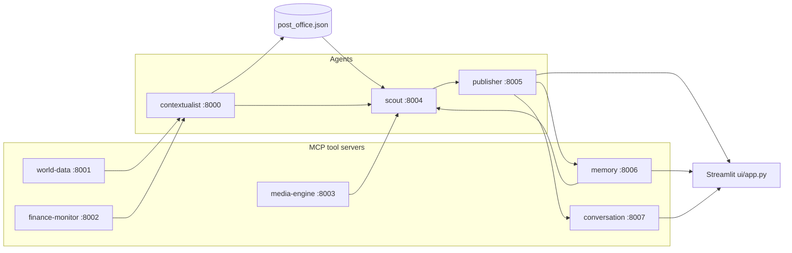

# SYNAPSE — Multi-agent context-aware reports (A2A + MCP)

This project wires several **FastMCP** servers together: lightweight "tool" servers (news, weather, FX, images, persistent memory, and conversation state) feed **agents** that coordinate through a tiny file-based mailbox (**post office** under `synapse/protocol/`). A **Streamlit** UI triggers the Scout and Publisher tools to produce an article grounded in aggregated signals — recalls prior coverage via semantic memory and supports multi-turn follow-up conversations on every brief.

## Architecture



- **world-data** — NewsAPI headline search and OpenWeather current conditions.
- **finance-monitor** — Resolves currency from location (REST Countries) and USD conversion rate (ExchangeRate-API).
- **media-engine** — Pexels image search.
- **memory** — Persistent semantic store backed by ChromaDB. Stores finished briefs and exposes cosine-similarity search so agents can recall related prior coverage.
- **conversation** — Stores multi-turn conversation state in a JSON file. Tracks every user question and assistant reply tied to a brief.
- **contextualist** — Calls world-data and finance-monitor, merges a structured signal, writes to the post office for the scout.
- **scout** — Drives contextualist and media-engine, queries the memory server for related past briefs, merges all signals for the Publisher.
- **publisher** — Generates the initial brief (augmented by past-brief context from memory), seeds a conversation record, and handles follow-up questions grounded in the original payload and conversation history.

Root-level `server.py` and `agent.py` are commented FastMCP examples only; they are not part of the running stack.

## What's new in this branch

### Multi-turn conversation state (`mcp-servers/conversation/`)

A new FastMCP server at port **8007** stores conversation threads in `synapse/conversations/conversations.json`. It exposes five tools:

| Tool | Description |
|------|-------------|
| `start_conversation` | Begin a new conversation seeded with the initial brief's article and payload. Returns a `conversation_id`. |
| `add_turn` | Append a single turn (`user` or `assistant`) to an existing conversation. |
| `get_conversation` | Return the full conversation record: metadata, initial payload, and all turns. |
| `list_conversations` | Return recent conversations in reverse-chronological order (metadata only, no turns). |
| `delete_conversation` | Remove a conversation (useful during development). |

### Conversation-aware Publisher Agent

The Publisher now exposes two tools:

- **`publish_brief`** — generates the initial article (informed by `memory_context` from the Scout), stores it in memory, and seeds a new conversation via the conversation server.
- **`follow_up`** — answers follow-up questions within an existing conversation. It fetches the conversation's original payload and turn history, builds a grounded prompt, appends the user's question, calls the LLM, and appends the reply — all without re-running the Scout pipeline. Up to the last 10 turns are included in the prompt (`MAX_TURNS_IN_PROMPT`).

### Chat-shaped Streamlit UI

The UI is now structured around conversations rather than one-shot report generation:

- **Conversations sidebar** — lists all past conversations with turn counts; clicking one loads it into the chat view.
- **New brief mode** — enter a topic, click **Generate Brief**; the pipeline runs and the UI automatically transitions to conversation mode.
- **Conversation mode** — renders all turns as chat bubbles (using `st.chat_message`), shows the related image with the first assistant reply, and accepts follow-up questions via `st.chat_input`.
- **Past Briefs sidebar** — retained from the memory feature; lists stored briefs with a full-article viewer.

### Diagnostics script

`diagnose_conversation.py` (repo root) — starts a test conversation, adds a follow-up turn, and verifies listing against the live conversation server.

---

## Prerequisites

- **Python 3.10+** (tested on 3.13).
- API keys from [OpenAI](https://platform.openai.com/), [NewsAPI](https://newsapi.org/register), [OpenWeatherMap](https://openweathermap.org/api), [ExchangeRate-API](https://www.exchangerate-api.com/), and [Pexels](https://www.pexels.com/api/).

## Setup

Clone the repo, create a virtual environment, install dependencies, and install the small local `synapse` package so `from synapse.protocol...` resolves from any working directory:

```bash
cd multi-agent-system-a2a-mcp
python3 -m venv .venv
source .venv/bin/activate   # Windows: .venv\Scripts\activate

pip install --upgrade pip
pip install -r requirements.txt
pip install -e .
```

Configure secrets (never commit `.env`; it is listed in `.gitignore`):

```bash
cp .env.example .env
# Edit .env and paste your keys.
```

## How to run

You need **one process per MCP/agent server** plus **Streamlit**. All HTTP MCP endpoints use host `0.0.0.0` so they listen on every interface; tools are exposed under each server's `/mcp` URL.

### Option A — Single shell (background workers)

From the repo root with the virtual environment activated:

```bash
chmod +x scripts/start_backends.sh
./scripts/start_backends.sh
```

That script starts world-data, finance-monitor, media-engine, memory, conversation, contextualist, scout, and publisher together. Leave it running.

In **another** terminal:

```bash
source .venv/bin/activate
streamlit run ui/app.py
```

Open the URL Streamlit prints (usually http://localhost:8501). Enter a topic and click **Generate Brief**.

### Option B — Separate terminals

With `source .venv/bin/activate` and repo root as the current directory:

| Terminal | Command |
|----------|---------|
| 1 | `python mcp-servers/world-data/server.py` |
| 2 | `python mcp-servers/finance-monitor/server.py` |
| 3 | `python mcp-servers/media-engine/server.py` |
| 4 | `python mcp-servers/memory/server.py` |
| 5 | `python mcp-servers/conversation/server.py` |
| 6 | `python agents/contextualist_agent/main.py` |
| 7 | `python agents/scout_agent/main.py` |
| 8 | `python agents/publisher_agent/main.py` |
| 9 | `streamlit run ui/app.py` |

### Service ports

| Component | HTTP port |
|-----------|-----------|
| Contextualist | 8000 |
| World data | 8001 |
| Finance monitor | 8002 |
| Media engine | 8003 |
| Scout | 8004 |
| Publisher | 8005 |
| Memory | 8006 |
| Conversation | 8007 |
| Streamlit | 8501 (default) |

## Configuration notes

- **Models:** The Publisher uses `gpt-5-nano` via `client.responses.create`, and the UI uses the same model name for location extraction (`ui/app.py`). If your OpenAI account does not expose that model, change both call sites to a model you have access to (for example `gpt-4o-mini`).
- **Post office:** `synapse/protocol/post_office.json` stores in-flight coordination messages between contextualist and scout. The scout clears it at the start of each run.
- **Memory store:** ChromaDB persists vectors under `synapse/memory_store/` (created on first run, git-ignored). See the memory branch notes for tuning the distance threshold.
- **Conversation store:** All conversation threads are persisted in `synapse/conversations/conversations.json`. Created automatically on first run and git-ignored.
- **Follow-up context window:** The Publisher's `follow_up` tool includes the last 10 turns in the LLM prompt (`MAX_TURNS_IN_PROMPT` in `agents/publisher_agent/main.py`). Increase it for longer coherent threads at the cost of more tokens.
- **Conversation server is optional:** If the conversation server is not running, `publish_brief` falls back gracefully — the brief is still generated and stored in memory, but no conversation is seeded and follow-ups won't be available.

## Troubleshooting

- **`ModuleNotFoundError: synapse`:** Run `pip install -e .` from the repository root inside your active virtual environment.
- **Timeouts or empty context:** Confirm all eight MCP processes are listening and `.env` keys are valid for the upstream APIs.
- **Conversations sidebar shows "Conversation server unavailable":** Start the conversation server with `python mcp-servers/conversation/server.py`. Follow-up chat requires this server.
- **Memory sidebar shows "Memory server unavailable":** Start the memory server with `python mcp-servers/memory/server.py`.
- **Follow-up returns "Conversation not found":** The conversation server's JSON file may have been deleted or the server restarted without state. Generate a fresh brief to start a new conversation.
- **ChromaDB download on first run:** The ONNX MiniLM embedding model (~80 MB) is downloaded from Hugging Face on first memory server start. Ensure internet access and disk space.

## Project layout

- `agents/` — Contextualist, Scout, Publisher FastMCP entrypoints.
- `mcp-servers/` — Tool MCP servers: world-data, finance-monitor, media-engine, memory, and **conversation**.
- `synapse/protocol/` — Post office helpers and persisted message file.
- `synapse/memory_store/` — ChromaDB vector store created on first run (git-ignored).
- `synapse/conversations/` — JSON store for conversation threads, created on first run (git-ignored).
- `ui/app.py` — Streamlit frontend with conversation sidebar, chat-shaped brief viewer, and past-brief panel.
- `diagnose_memory.py` — Dev utility for testing semantic search against the running memory server.
- `diagnose_conversation.py` — Dev utility for testing the conversation server end-to-end.
