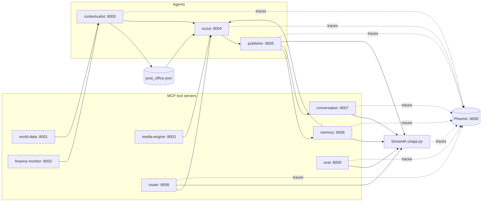

# SYNAPSE — Multi-agent context-aware reports (A2A + MCP)

This project wires several **FastMCP** servers together: lightweight "tool" servers (news, weather, FX, images, persistent memory, conversation state, an LLM-powered router, and an **evaluation engine**) feed **agents** that coordinate through a tiny file-based mailbox (**post office** under `synapse/protocol/`). A **Streamlit** UI triggers the Scout and Publisher tools to produce an article grounded in aggregated signals — with dynamic tool selection, intent-aware follow-up routing, end-to-end tracing via Arize Phoenix, and **LLM-as-judge evaluation** of every generated brief.

## Architecture



- **world-data** — NewsAPI headline search and OpenWeather current conditions.
- **finance-monitor** — Resolves currency from location (REST Countries) and USD conversion rate (ExchangeRate-API).
- **media-engine** — Pexels image search.
- **memory** — Persistent semantic store backed by ChromaDB.
- **conversation** — Stores multi-turn conversation state in a JSON file.
- **router** — LLM-powered routing: decides which tools to invoke per topic and classifies follow-up intent.
- **eval** — LLM-as-judge evaluation engine. Scores briefs on five dimensions and stores run history.
- **contextualist** — Calls world-data and finance-monitor based on routing flags, writes signal to the post office.
- **scout** — Orchestrates contextualist, media-engine, and memory; passes routing-selected signals to the Publisher.
- **publisher** — Generates briefs (augmented by memory context), seeds conversations, and handles follow-ups.

Root-level `server.py` and `agent.py` are commented FastMCP examples only; they are not part of the running stack.

## What's new in this branch

### LLM-as-judge Evaluation Engine (`mcp-servers/eval/`)

A new FastMCP server at port **8009** provides automated quality measurement for every brief produced by the pipeline. It exposes five tools:

| Tool | Description |
|------|-------------|
| `judge_brief` | Scores a brief against five rubric dimensions using an LLM judge. Returns scores in [0.0, 1.0] plus a reasoning sentence. |
| `store_eval_run` | Persists a completed eval run (all topic results + aggregates) to `evals/results/runs.json`. |
| `list_eval_runs` | Returns all stored runs newest-first as lightweight summaries (no per-topic data). |
| `get_eval_run` | Returns the full data for a single run, including per-topic results and articles. |
| `delete_eval_run` | Removes a run (useful for discarding exploratory or failed runs). |

#### Rubric dimensions

Each brief is scored on five dimensions by the LLM judge:

| Dimension | What it measures |
|-----------|-----------------|
| **faithfulness** | Are factual claims grounded in the source data? |
| **coverage** | Does the brief contain all required sections (headline, body, Why it matters, About the place)? |
| **specificity** | Are proper nouns, figures, and dates cited from the source? |
| **hallucination** | Is the brief free of fabricated content? (higher = cleaner) |
| **overall** | Holistic quality, weighted toward faithfulness and specificity. |

Topic-specific `rubric_hints` in `evals/dataset.json` (e.g. "must cite Sensex/Nifty", "penalize invented film titles") are injected into the judge prompt for more precise scoring.

### Eval dataset (`evals/dataset.json`)

20 curated topics across five categories — Finance, Tech, Geopolitics, Climate, Policy, Entertainment, and Sports — each with an `expected_city`, `tags`, and per-topic `rubric_hints` for the judge. Topics are weighted toward India-focused news to stress-test the pipeline on its most common use case.

### Eval runner (`evals/run_eval.py`)

A standalone CLI script that runs the full Scout → Publisher pipeline on every dataset entry, calls the judge, and stores results via the eval server:

```bash
# Smoke test (3 topics, ~1-2 min)
python evals/run_eval.py --limit 3

# Full run (20 topics, ~5-10 min)
python evals/run_eval.py

# Custom dataset
python evals/run_eval.py --dataset path/to/other.json
```

Prints a live progress table and a score bar chart summary on completion. Falls back to writing results directly to `evals/results/<run_id>.json` if the eval server is unreachable.

### Evals dashboard (`ui/pages/1_📊_Evals.py`)

A new Streamlit page (auto-linked from the sidebar) with:

- **Top-level metrics** — total runs, latest topic count, latest avg overall score, success rate.
- **Score trend chart** — line chart of all five dimensions across historical runs.
- **Run history picker** — dropdown of all runs with short label showing overall score.
- **Per-run detail** — progress bars for each dimension average, full per-topic results table with `ProgressColumn` styling.
- **Topic drill-down** — select any topic to see its individual scores, judge reasoning, generated article, and rubric hints.
- **Phoenix link** in the sidebar for navigating directly to traces.

---

## Prerequisites

- **Python 3.10+** (tested on 3.13).
- API keys from [OpenAI](https://platform.openai.com/), [NewsAPI](https://newsapi.org/register), [OpenWeatherMap](https://openweathermap.org/api), [ExchangeRate-API](https://www.exchangerate-api.com/), and [Pexels](https://www.pexels.com/api/).

## Setup

Clone the repo, create a virtual environment, install dependencies, and install the small local `synapse` package:

```bash
cd multi-agent-system-a2a-mcp
python3 -m venv .venv
source .venv/bin/activate   # Windows: .venv\Scripts\activate

pip install --upgrade pip
pip install -r requirements.txt
pip install -e .
```

Configure secrets (never commit `.env`; it is listed in `.gitignore`):

```bash
cp .env.example .env
# Edit .env and paste your keys.
```

## How to run

### Option A — Single shell (recommended)

```bash
chmod +x scripts/start_backends.sh
./scripts/start_backends.sh
```

Starts Phoenix, all seven MCP servers, and three agents. Then in another terminal:

```bash
source .venv/bin/activate
streamlit run ui/app.py
```

Open **http://localhost:8501** for the app, **http://localhost:6006** for Phoenix traces, and navigate to the **📊 Evals** page in the Streamlit sidebar. To run evals:

```bash
python evals/run_eval.py --limit 3   # smoke test
python evals/run_eval.py             # full 20-topic run
```

### Option B — Separate terminals

| Terminal | Command |
|----------|---------|
| 1 | `phoenix serve` |
| 2 | `python mcp-servers/world-data/server.py` |
| 3 | `python mcp-servers/finance-monitor/server.py` |
| 4 | `python mcp-servers/media-engine/server.py` |
| 5 | `python mcp-servers/memory/server.py` |
| 6 | `python mcp-servers/conversation/server.py` |
| 7 | `python mcp-servers/router/server.py` |
| 8 | `python mcp-servers/eval/server.py` |
| 9 | `python agents/contextualist_agent/main.py` |
| 10 | `python agents/scout_agent/main.py` |
| 11 | `python agents/publisher_agent/main.py` |
| 12 | `streamlit run ui/app.py` |

### Service ports

| Component | HTTP port |
|-----------|-----------|
| Contextualist | 8000 |
| World data | 8001 |
| Finance monitor | 8002 |
| Media engine | 8003 |
| Scout | 8004 |
| Publisher | 8005 |
| Memory | 8006 |
| Conversation | 8007 |
| Router | 8008 |
| Eval | 8009 |
| Phoenix UI + OTLP collector | 6006 |
| Streamlit | 8501 (default) |

## Configuration notes

- **Models:** All LLM calls (Publisher, Router, Eval judge) use `gpt-5-nano`. Change all call sites to a model you have access to if needed (e.g. `gpt-4o-mini`).
- **Post office:** `synapse/protocol/post_office.json` stores in-flight coordination messages. The scout clears it at the start of each run.
- **Memory store:** ChromaDB persists under `synapse/memory_store/` (git-ignored). Clear it between eval runs for a clean baseline.
- **Conversation store:** Threads persist in `synapse/conversations/conversations.json` (git-ignored).
- **Eval results:** Stored in `evals/results/runs.json` (git-ignored). Results survive server restarts.
- **Pivot confidence threshold:** Adjust `PIVOT_CONFIDENCE_THRESHOLD` in `ui/app.py` (default `0.70`).
- **Phoenix endpoint:** Override with `PHOENIX_COLLECTOR_ENDPOINT`. Tracing degrades to no-op if Phoenix is unavailable.
- **Eval server is optional:** If port 8009 is not running, `run_eval.py` writes results directly to `evals/results/<run_id>.json` as a fallback.

## Troubleshooting

- **`ModuleNotFoundError: synapse`:** Run `pip install -e .` from the repository root.
- **Evals page empty / "Eval server unavailable":** Start the eval server with `python mcp-servers/eval/server.py`. You can still run `run_eval.py` — it saves results locally as a fallback.
- **No spans in Phoenix:** Ensure `phoenix serve` started before the agents. Restart agents after Phoenix is up.
- **Eval run is slow:** Each topic runs the full pipeline + one LLM judge call. A 20-topic run takes ~5-10 minutes. Use `--limit 3` for a quick smoke test.
- **ChromaDB download on first run:** ONNX MiniLM model (~80 MB) downloaded from Hugging Face on first memory server start.
- **Timeouts or empty context:** Confirm all ten MCP processes are listening and `.env` keys are valid.

## Project layout

- `agents/` — Contextualist, Scout, Publisher FastMCP entrypoints.
- `mcp-servers/` — Tool MCP servers: world-data, finance-monitor, media-engine, memory, conversation, router, and **eval**.
- `evals/dataset.json` — 20 curated evaluation topics with rubric hints and tags.
- `evals/run_eval.py` — CLI eval runner: full pipeline → LLM judge → result storage.
- `evals/results/` — Persisted run JSON files (git-ignored).
- `synapse/protocol/` — Post office helpers and persisted message file.
- `synapse/tracing.py` — Centralized Phoenix/OpenTelemetry setup with fail-safe no-op fallback.
- `synapse/memory_store/` — ChromaDB vector store (git-ignored).
- `synapse/conversations/` — Conversation thread JSON store (git-ignored).
- `ui/app.py` — Main Streamlit app.
- `ui/pages/1_📊_Evals.py` — **NEW:** Eval results dashboard page.
- `diagnose_memory.py` — Dev utility for testing semantic search.
- `diagnose_conversation.py` — Dev utility for testing the conversation server.
- `diagnose_route.py` — Dev utility for testing routing decisions.
