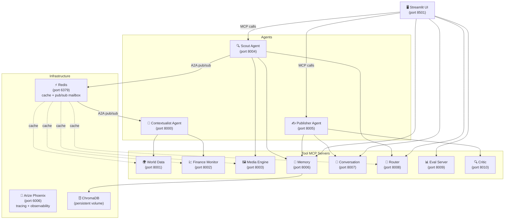

# SYNAPSE — Multi-agent context-aware reports (A2A + MCP)

This project wires several **FastMCP** servers together: lightweight "tool" servers (news, weather, FX, images, persistent memory, conversation state, an LLM-powered router, an evaluation engine, and a self-critique loop) feed **agents** that coordinate through a **Redis pub/sub message broker** (with a JSON-file fallback). A **Streamlit** UI triggers the Scout and Publisher tools to produce an article grounded in aggregated signals — with dynamic tool selection, intent-aware follow-up routing, end-to-end tracing via Arize Phoenix, LLM-as-judge evaluation, a draft → critique → revise cycle, Redis-backed caching, per-run LLM cost tracking, real-time A2A messaging via Redis pub/sub, and now a **full Docker Compose deployment** — spin the entire stack with one command.

## Architecture



## Services

| Service | Port | Role |
|---------|------|------|
| Contextualist Agent | 8000 | Gathers weather, news, FX for a city; reached via Redis pub/sub |
| World Data MCP | 8001 | Weather + news tools |
| Finance Monitor MCP | 8002 | FX rates tool |
| Media Engine MCP | 8003 | Pexels image search |
| Scout Agent | 8004 | Orchestrates full brief pipeline; talks to Contextualist over Redis |
| Publisher Agent | 8005 | Turns Scout output into polished article; runs self-critique loop |
| Memory MCP | 8006 | ChromaDB semantic search — stores/retrieves past briefs |
| Conversation MCP | 8007 | Multi-turn conversation state (JSON store) |
| Router MCP | 8008 | LLM-powered tool selection + intent classification |
| Eval Server MCP | 8009 | LLM-as-judge scoring (5-dimension rubric), run storage |
| Critic MCP | 8010 | Draft review — approve or revise with issues list |
| Redis | 6379 | Caching (TTL per data type) + A2A pub/sub mailbox |
| Arize Phoenix | 6006 | Distributed tracing dashboard |

## What's new in this branch

### Docker Compose deployment (`docker-compose.yml`)

The entire SYNAPSE stack — 2 infrastructure containers, 8 tool MCP servers, 3 agents, and the Streamlit UI — runs with a single command:

```bash
docker compose up --build
```

Highlights:
- **Single image, multiple containers** — one `Dockerfile` builds a `python:3.11-slim` image shared by all Python services. Each `docker-compose` service runs the same image with a different `command:`.
- **Dependency graph** — Redis and Phoenix start first (with `healthcheck` conditions). Tool servers wait on healthy Redis/Phoenix. Agents wait on their tool servers. The UI waits on all agents.
- **Named volumes** — `memory-store`, `conversations-data`, `eval-results`, and `phoenix-data` are mounted as Docker volumes so persistent data survives container restarts.
- **Only 3 ports exposed externally**: `8501` (UI), `6006` (Phoenix), `6379` (Redis — kept open so `watch_mailbox.py` and `redis-cli` work from the host). All service-to-service traffic is internal Docker networking.
- **`env_file: .env`** — all API keys come from your local `.env`. Docker Compose overrides `PHOENIX_COLLECTOR_ENDPOINT` and `REDIS_URL` (and service host vars) per container automatically.

### Centralized service URL config (`synapse/config.py`)

All service URLs now live in one place. Each host is read from an env var with `0.0.0.0` as the default:

```python
from synapse.config import SCOUT_URL, PUBLISHER_URL, MEMORY_URL
```

- **Local dev** — no env vars set → `0.0.0.0` default → same behavior as before.
- **Docker Compose** — sets `WORLD_DATA_HOST=world-data`, `FINANCE_HOST=finance-monitor`, etc. per service via `environment:`. Containers find each other by Docker service name.
- **Kubernetes** (future) — set the same vars via ConfigMap, zero code changes.

All agents (`scout`, `publisher`, `contextualist`) and `ui/app.py` now import URLs from `synapse.config` instead of hardcoding strings.

### `.env.example` updated

Includes all service-host variables with comments explaining when to set them. Copy to `.env`, fill in API keys, and Docker Compose picks it up automatically.

### `.dockerignore`

Excludes `.venv/`, `__pycache__/`, `.git/`, `.env`, and local persistent-data directories (`synapse/memory_store/`, `synapse/conversations/`, `evals/results/`) from the build context — keeping the image lean and secrets out of layers.

## Prerequisites

- Docker + Docker Compose (v2) — `docker compose version`
- OR Python 3.11+ with a venv for local dev
- API keys: OpenAI, NewsAPI, OpenWeather, ExchangeRate-API, Pexels

## How to run

### Option A — Docker Compose (recommended)

```bash
cp .env.example .env
# Fill in your API keys in .env

docker compose up --build
```

Wait for Phoenix and Redis health checks to pass (~15 s), then open `http://localhost:8501`.

To tail logs for a single service:
```bash
docker compose logs -f scout
```

To watch the A2A mailbox from your host:
```bash
python scripts/watch_mailbox.py        # Redis still exposed on 6379
```

To run evals:
```bash
docker compose run --rm ui python evals/run_eval.py --limit 5
```

### Option B — Local Python (manual)

```bash
python -m venv .venv && source .venv/bin/activate
pip install -r requirements.txt && pip install -e .

# Terminal 1 — Redis
redis-server
# Terminal 2 — Phoenix (Docker or pip install arize-phoenix)
python -m phoenix.server.main serve

# Terminals 3-16 — one per service
python mcp-servers/world-data/server.py
python mcp-servers/finance-monitor/server.py
# ... (see scripts/start_backends.sh for the full sequence)
```

## Configuration

| Variable | Default | Purpose |
|----------|---------|---------|
| `OPENAI_API_KEY` | — | Required |
| `NEWS_API_KEY` | — | NewsAPI |
| `OPENWEATHER_API_KEY` | — | OpenWeather |
| `EXCHANGE_RATE_API_KEY` | — | FX rates |
| `PEXELS_API_KEY` | — | Image search |
| `REDIS_URL` | `redis://localhost:6379` | Cache + pub/sub (auto-overridden in Compose) |
| `PHOENIX_COLLECTOR_ENDPOINT` | `http://localhost:6006` | Tracing (auto-overridden in Compose) |
| `SYNAPSE_ENABLE_CRITIC` | `true` | Enable/disable self-critique loop |
| `SYNAPSE_MAX_REVISIONS` | `2` | Max critique iterations |
| `SYNAPSE_USD_TO_INR` | `84.0` | Cost display currency conversion |
| `*_HOST` vars | `0.0.0.0` | Service host — set by Compose; leave unset for local dev |

## Troubleshooting

| Symptom | Fix |
|---------|-----|
| UI container starts before Scout is ready | Run `docker compose up --build` again — services retry on startup |
| `redis-cli` can't connect | Port 6379 is exposed; check `docker compose ps` for synapse-redis status |
| Phoenix not receiving traces | Ensure Phoenix container passed its healthcheck: `docker compose ps phoenix` |
| Memory store empty after restart | Check the `memory-store` volume: `docker volume inspect multi-agent-system-a2a-mcp_memory-store` |
| Build fails on `requirements.txt not found` | Run `docker compose up --build` from the repo root (where `requirements.txt` lives) |
| `OPENAI_API_KEY` not set | Copy `.env.example` → `.env` and fill in your keys before `docker compose up` |

## Project layout

```
.
├── dockerfile                    # Single image for all Python services
├── docker-compose.yml            # Full stack — 16 services
├── .dockerignore                 # Keeps secrets and local data out of the image
├── .env.example                  # Copy to .env — all vars documented
├── synapse/
│   ├── config.py                 # Centralized URL resolver (env-var + port)
│   ├── tracing.py                # OpenTelemetry / Phoenix setup
│   ├── cache.py                  # Redis cache with TTL-per-namespace
│   ├── costs.py                  # Token usage extraction + INR formatting
│   └── protocol/
│       └── post_office.py        # Redis pub/sub mailbox (JSON fallback)
├── agents/
│   ├── contextualist_agent/main.py
│   ├── scout_agent/main.py
│   └── publisher_agent/main.py
├── mcp-servers/
│   ├── world-data/server.py      # port 8001
│   ├── finance-monitor/server.py # port 8002
│   ├── media-engine/server.py    # port 8003
│   ├── memory/server.py          # port 8006 — ChromaDB
│   ├── conversation/server.py    # port 8007
│   ├── router/server.py          # port 8008 — LLM routing
│   ├── eval/server.py            # port 8009 — LLM-as-judge
│   └── critic/server.py          # port 8010 — self-critique
├── ui/
│   ├── app.py                    # Streamlit main app (port 8501)
│   └── pages/
│       └── 1_📊_Evals.py
├── evals/
│   ├── dataset.json              # 20 curated eval topics
│   └── run_eval.py               # CLI eval runner
└── scripts/
    ├── start_backends.sh         # Local dev helper
    └── watch_mailbox.py          # Redis pub/sub mailbox live-tail
```
