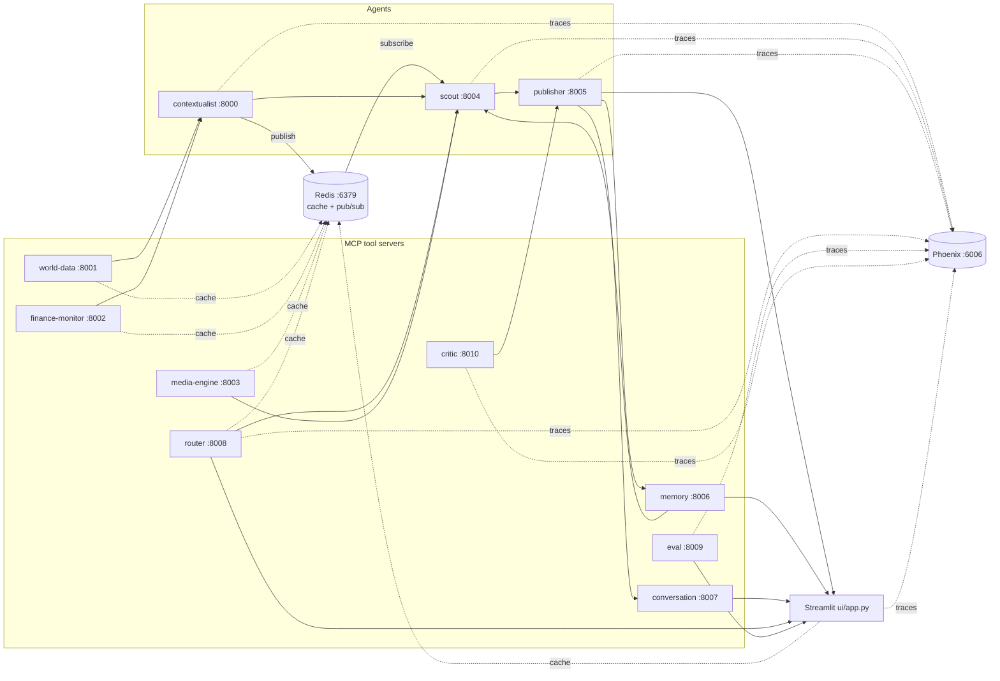

# SYNAPSE — Multi-agent context-aware reports (A2A + MCP)

This project wires several **FastMCP** servers together: lightweight "tool" servers (news, weather, FX, images, persistent memory, conversation state, an LLM-powered router, an evaluation engine, and a self-critique loop) feed **agents** that coordinate through a **Redis pub/sub message broker** (with a JSON-file fallback). A **Streamlit** UI triggers the Scout and Publisher tools to produce an article grounded in aggregated signals — with dynamic tool selection, intent-aware follow-up routing, end-to-end tracing via Arize Phoenix, LLM-as-judge evaluation, a draft → critique → revise cycle, Redis-backed caching, per-run LLM cost tracking, and now **real-time A2A messaging via Redis pub/sub**.

## Architecture



- **world-data** — NewsAPI headline search and OpenWeather current conditions. Results cached in Redis.
- **finance-monitor** — Currency resolution and USD conversion rate. Results cached in Redis.
- **media-engine** — Pexels image search. Results cached in Redis.
- **memory** — Persistent semantic store backed by ChromaDB.
- **conversation** — Stores multi-turn conversation state in a JSON file.
- **router** — LLM-powered routing: tool selection per topic (cached) and follow-up intent classification.
- **eval** — LLM-as-judge evaluation engine.
- **critic** — LLM editor for the draft → critique → revise loop.
- **contextualist** — Calls world-data and finance-monitor based on routing flags; publishes the signal to the Scout's Redis channel.
- **scout** — Subscribes to `synapse:mailbox:scout` at startup; orchestrates contextualist, media-engine, and memory.
- **publisher** — Runs the draft → critique → revise loop; tracks and returns consolidated LLM cost.

Root-level `server.py` and `agent.py` are commented FastMCP examples only.

## What's new in this branch

### Redis pub/sub message broker (`synapse/protocol/post_office.py`)

The A2A mailbox has been upgraded from a shared JSON file to **Redis pub/sub**. The module keeps the exact same three-function API that the rest of the codebase has used since day one — no call-site changes in the agents:

```python
send_message(message)   # publish to recipient's Redis channel
read_messages()         # drain this agent's in-process message buffer
clear_messages()        # empty this agent's buffer
```

A new `init_mailbox(agent_name)` initializer must be called once at process startup for any agent that **reads** messages. It subscribes the process to `synapse:mailbox:<name>` and starts a background thread that pipes incoming Redis messages into a local buffer. The Contextualist (publish-only) does not need to call it.

#### How it works

- **Publish (`send_message`)** — serializes the message to JSON and calls `PUBLISH synapse:mailbox:<recipient>`.
- **Subscribe (`init_mailbox`)** — creates a Redis `pubsub` object, subscribes to the agent's channel, and starts a daemon `Thread` that calls `_pubsub.listen()` in a loop, appending each message to a thread-safe `_message_buffer`.
- **Read (`read_messages`)** — returns a snapshot of `_message_buffer` under a lock.
- **Clear (`clear_messages`)** — empties `_message_buffer` under a lock.
- **Faster polling** — `wait_for_response` in the Scout now polls at 200 ms instead of 500 ms; since Redis delivery is near-instant the response typically arrives on the first or second poll.

#### Fail-safe file fallback

If Redis is unreachable (connection refused, package not installed, or mid-run failure), the module automatically falls back to the original JSON-file behavior (`synapse/protocol/post_office.json`) — no code changes required anywhere. The fallback mode is logged on startup and surfaced in the UI.

| Backend | When used |
|---------|-----------|
| `redis` | Redis reachable at `REDIS_URL` |
| `file` | Redis unreachable — falls back to `post_office.json` |

#### Observability

Every `send_message`, `read_messages`, and `clear_messages` call is wrapped in an OpenTelemetry span (`post_office.send`, `post_office.read`, `post_office.clear`) with `backend`, `sender`, `recipient`, `task_id`, and `channel` attributes — visible in Phoenix.

A `mode()` helper and a `stats()` dict expose the current backend, agent name, buffered message count, and channel name for the UI and debugging.

### Mailbox status badge in the Streamlit UI

The sidebar now shows the active mailbox backend:
- `📬 Mailbox: Redis pub/sub (live)` when Redis is connected.
- `📬 Mailbox: JSON file (Redis fallback)` when falling back to the file.

### Mailbox watcher (`scripts/watch_mailbox.py`)

A new developer utility that subscribes to every `synapse:mailbox:*` channel via Redis `PSUBSCRIBE` and pretty-prints each A2A message with ANSI colors as it arrives. Run it in a side terminal to watch the Contextualist → Scout handoff in real time:

```bash
python scripts/watch_mailbox.py
```

Output example:
```
📬 SYNAPSE mailbox watcher
   Pattern: synapse:mailbox:*
   Redis:   redis://localhost:6379

[14:32:01.847] contextualist → scout (done, task=task-1)
  channel: synapse:mailbox:scout
  {
    "topic": "Indian semiconductor manufacturing",
    ...
  }
```

### Redis now serves two roles

From this branch onward, Redis is used for both:
1. **Cache** (Day 9) — tool-server response caching with TTL.
2. **Mailbox** (Day 10) — A2A pub/sub between the Contextualist and Scout.

The startup script reflects this and updated its Redis health-check message accordingly.

---

## Prerequisites

- **Python 3.10+** (tested on 3.13).
- **Redis** (strongly recommended — both caching and pub/sub depend on it). Install via `brew install redis`, `apt install redis-server`, or `docker run -d -p 6379:6379 redis`.
- API keys from [OpenAI](https://platform.openai.com/), [NewsAPI](https://newsapi.org/register), [OpenWeatherMap](https://openweathermap.org/api), [ExchangeRate-API](https://www.exchangerate-api.com/), and [Pexels](https://www.pexels.com/api/).

## Setup

```bash
cd multi-agent-system-a2a-mcp
python3 -m venv .venv
source .venv/bin/activate   # Windows: .venv\Scripts\activate

pip install --upgrade pip
pip install -r requirements.txt
pip install -e .
```

Configure secrets:

```bash
cp .env.example .env
# Edit .env and paste your keys.
# Optional: REDIS_URL (default redis://localhost:6379), SYNAPSE_USD_TO_INR
```

## How to run

### Option A — Single shell (recommended)

```bash
# Start Redis first
brew services start redis       # macOS
# or: docker run -d -p 6379:6379 redis

chmod +x scripts/start_backends.sh
./scripts/start_backends.sh
```

Then in another terminal:

```bash
source .venv/bin/activate
streamlit run ui/app.py
```

To watch A2A messages in real time (optional, third terminal):

```bash
python scripts/watch_mailbox.py
```

Open **http://localhost:8501** for the app, **http://localhost:6006** for Phoenix traces.

### Option B — Separate terminals

| Terminal | Command |
|----------|---------|
| 1 | `redis-server` (or start as a service) |
| 2 | `phoenix serve` |
| 3 | `python mcp-servers/world-data/server.py` |
| 4 | `python mcp-servers/finance-monitor/server.py` |
| 5 | `python mcp-servers/media-engine/server.py` |
| 6 | `python mcp-servers/memory/server.py` |
| 7 | `python mcp-servers/conversation/server.py` |
| 8 | `python mcp-servers/router/server.py` |
| 9 | `python mcp-servers/eval/server.py` |
| 10 | `python mcp-servers/critic/server.py` |
| 11 | `python agents/contextualist_agent/main.py` |
| 12 | `python agents/scout_agent/main.py` |
| 13 | `python agents/publisher_agent/main.py` |
| 14 | `streamlit run ui/app.py` |
| *(opt)* | `python scripts/watch_mailbox.py` |

### Service ports

| Component | HTTP port |
|-----------|-----------|
| Contextualist | 8000 |
| World data | 8001 |
| Finance monitor | 8002 |
| Media engine | 8003 |
| Scout | 8004 |
| Publisher | 8005 |
| Memory | 8006 |
| Conversation | 8007 |
| Router | 8008 |
| Eval | 8009 |
| Critic | 8010 |
| Redis | 6379 |
| Phoenix UI + OTLP collector | 6006 |
| Streamlit | 8501 (default) |

## Configuration notes

- **Redis URL:** `REDIS_URL` (default `redis://localhost:6379`). Used for both caching and the mailbox pub/sub channel.
- **Mailbox fallback:** If Redis is unreachable, A2A messaging falls back to `synapse/protocol/post_office.json` — the system works, but without the speed or observability of Redis.
- **INR rate:** `SYNAPSE_USD_TO_INR` (default `84.0`) for UI cost display.
- **Critic toggle:** `SYNAPSE_ENABLE_CRITIC=false` / `SYNAPSE_MAX_REVISIONS=N`.
- **Models:** All LLM calls use `gpt-5-nano`. Change all call sites if needed.
- **Phoenix endpoint:** `PHOENIX_COLLECTOR_ENDPOINT` (default `http://localhost:6006`).

## Troubleshooting

- **`ModuleNotFoundError: synapse`:** Run `pip install -e .` from the repo root.
- **`[post_office] Redis unavailable, falling back to file mode`:** Start Redis. The pipeline still works in file mode but A2A messages won't be visible in `watch_mailbox.py` or Phoenix pub/sub spans.
- **Scout times out waiting for context:** In file mode, `wait_for_response` polls `post_office.json`. Ensure no stale messages from a previous run are blocking. Regenerating a brief clears the file.
- **`watch_mailbox.py` shows no messages:** Redis must be running. Verify with `redis-cli ping`.
- **Cache or mailbox unexpectedly in file mode mid-run:** Redis may have restarted. The post-office reconnects on the next `init_mailbox` call (i.e., next Scout process start).
- **No spans in Phoenix:** Ensure `phoenix serve` started before the agents.
- **Timeouts or empty context:** Confirm all services are running and `.env` keys are valid.

## Project layout

- `agents/` — Contextualist (publish-only), Scout (subscribes via `init_mailbox`), Publisher.
- `mcp-servers/` — world-data, finance-monitor, media-engine, memory, conversation, router, eval, critic.
- `evals/dataset.json` — 20 curated evaluation topics.
- `evals/run_eval.py` — CLI eval runner.
- `evals/results/` — Persisted run JSON files (git-ignored).
- `synapse/cache.py` — Redis-backed cache with fail-safe no-op fallback.
- `synapse/costs.py` — Token normalization and USD/INR cost estimation.
- `synapse/tracing.py` — Centralized Phoenix/OpenTelemetry setup.
- `synapse/protocol/post_office.py` — **Updated:** Redis pub/sub mailbox with JSON-file fallback.
- `synapse/memory_store/` — ChromaDB vector store (git-ignored).
- `synapse/conversations/` — Conversation thread JSON store (git-ignored).
- `scripts/watch_mailbox.py` — **NEW:** Live-tail A2A messages from the Redis mailbox.
- `ui/app.py` — Main Streamlit app with mailbox backend badge.
- `ui/pages/1_📊_Evals.py` — Eval results dashboard.
- `diagnose_memory.py` — Dev utility for semantic search testing.
- `diagnose_conversation.py` — Dev utility for conversation server testing.
- `diagnose_route.py` — Dev utility for routing decisions testing.
